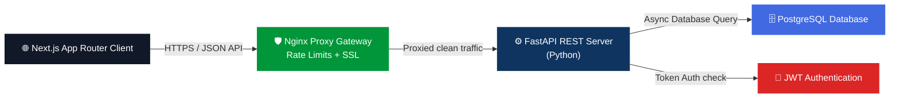

<div align="center">

# 🏢 Leave Management System

### A Modern, Role-Based Employee Leave Management Platform

[](https://nextjs.org/)
[](https://fastapi.tiangolo.com/)
[](https://www.postgresql.org/)
[](https://www.python.org/)
[](https://nginx.org/)
[](LICENSE)

---

**Digitize your leave workflows** — from instant submissions to manager reviews — with secure role-based portals, automated validation constraints, beautiful dark mode analytics, and gateway shielding.

[🚀 Quick Start](#-quick-start) · [📖 Documentation](#-documentation) · [✨ Features](#-features) · [🏗️ Architecture](#️-architecture)

</div>

---

## ✨ Features

<table>
<tr>
<td width="50%">

### 👤 Employee Portal
- ✅ Apply for leave (Casual, Sick, Earned, Unpaid)
- ✅ Track leave request status in real-time
- ✅ View leave balance with visual indicators
- ✅ Cancel pending requests
- ✅ Personal dashboard with quick actions

</td>
<td width="50%">

### 👔 Manager Console
- ✅ Review pending leave requests from direct reports
- ✅ Approve or reject with comments
- ✅ Team availability overview
- ✅ Pending request badge notifications
- ✅ Approval audit trail

</td>
</tr>
<tr>
<td width="50%">

### 🛡️ Admin Panel
- ✅ Full employee CRUD management
- ✅ Role & department assignment
- ✅ Organization-wide statistics
- ✅ Leave balance management
- ✅ System-wide analytics dashboard

</td>
</tr>
<tr>
<td width="50%">

### 👑 Super Admin Portal
- ✅ Create and manage Admin accounts
- ✅ Configure system-wide settings
- ✅ Organization-wide reports and analytics
- ✅ Role and department oversight
- ✅ Global leave policy management

</td>
<td width="50%">

### 📊 Analytics Dashboard
- ✅ Leave statistics cards with live data
- ✅ Department-wise leave distribution
- ✅ Monthly leave trend charts
- ✅ Role-based view customization
- ✅ Color-coded status indicators

</td>
</tr>
</table>

---

## 🎨 Design Philosophy

> **Premium. Dark. Alive.**

The UI is built with a **modern dark theme** featuring:

| Element | Style | Description |
|---------|-------|-------------|
| 🌑 **Background** | Deep navy gradient (`#0b0c16` → `#111326`) | Premium, non-generic dark scheme |
| 🪟 **Cards** | Glassmorphism with backdrop blur | Translucent cards with thin borders and shadow elevations |
| 💜 **Primary** | Electric Indigo `#4F46E5` | Striking accents for core call-to-actions |
| 💚 **Success** | Emerald `#10B981` | Approved indicators and credit counts |
| 🟡 **Warning** | Amber `#F59E0B` | Pending status indicators |
| 🔴 **Danger** | Rose `#F43F5E` | Rejected states or deactivations |
| 🔤 **Typography** | [Inter](https://fonts.google.com/specimen/Inter) | Clean, geometric font for supreme scan-readability |
| ✨ **Animations** | Smooth micro-interactions | Dynamic card hovers, pulsing buttons, and layout transitions |

---

## 🏗️ Architecture



| Layer | Technology | Purpose |
|-------|-----------|---------|
| **Frontend** | Next.js 14/15 (App Router) | High-fidelity hybrid SPA utilizing native Fetch APIs |
| **Backend** | Python + FastAPI | High-performance, asynchronous RESTful API server |
| **Database** | PostgreSQL 15+ | Relational storage guaranteeing transactional ACID safety |
| **Auth** | JWT (PyJWT) + bcrypt | Stateless authentication tokens & dynamically salted hashes |
| **Security** | Nginx Reverse Proxy | SSL/TLS termination, local rate limiting, and port shielding |

---

## 🚀 Quick Start

### Prerequisites

- [Node.js](https://nodejs.org/) v18 or higher
- [Python](https://www.python.org/) v3.10 or higher
- [PostgreSQL](https://www.postgresql.org/) v15 or higher
- npm (comes packaged with Node.js)
- pip (comes packaged with Python)

### Installation

```bash
# 1. Clone the repository
git clone https://github.com/your-username/Leaveflow-management.git
cd Leaveflow-management

# 2. Set up the PostgreSQL database
createdb leave_management

# 3. Setup and start the Python Backend
cd server
python -m venv venv

# Activate Virtual Environment:
# On Windows (PowerShell):
.\venv\Scripts\Activate.ps1
# On macOS / Linux:
source venv/bin/activate

# Install dependencies:
pip install -r requirements.txt

# Configure environment:
# Copy .env.example to .env and configure DATABASE_URL + JWT_SECRET
cp .env.example .env

# Seed initial database structure and demo data:
python db/seed.py

# Launch FastAPI ASGI dev server:
uvicorn main:app --host 0.0.0.0 --port 8000 --reload

# 4. Setup and start Next.js Frontend
# Open a new terminal in the project root directory
cd client
npm install

# Configure environment:
# Copy .env.local.example to .env.local and configure NEXT_PUBLIC_API_URL
cp .env.local.example .env.local

# Launch Next.js dev server:
npm run dev
```

### 🌐 Dev Ports

```
Next.js Frontend:   http://localhost:3000
FastAPI Swagger UI: http://localhost:8000/docs
FastAPI Backend:    http://localhost:8000/api
```

---

## 🔑 Demo Credentials

| Role | Email | Password | Description |
|:----:|-------|:--------:|-------------|
| 👑 **Super Admin** | `superadmin@company.com` | `password123` | System governance, Admin creation, Org reports |
| 🛡️ **Admin** | `admin@company.com` | `password123` | Full access to organizational management |
| 👔 **Manager** | `alice@company.com` | `password123` | Direct report approvals & team statistics |
| 👔 **Manager** | `bob@company.com` | `password123` | Direct report approvals & team statistics |
| 👤 **Employee** | `john@company.com` | `password123` | Apply leave, view personal balances & status |
| 👤 **Employee** | `jane@company.com` | `password123` | Apply leave, view personal balances & status |

---

## 📂 Project Structure

```
Leaveflow-management/
│
├── 📁 docs/                          # 📖 Engineering Design Documentation
│   ├── 01-PRD.md                     #    Product Requirements Document
│   ├── 02-TRD.md                     #    Technology Stack Requirements & WAF rules
│   ├── 03-User-Stories.md            #    User Stories & Acceptances
│   ├── 04-User-Flows.md             #    Mermaid User Journeys
│   ├── 05-HLD.md                     #    High Level System Architecture
│   ├── 06-LLD.md                     #    Low Level Database & Module Design
│   ├── 07-API-Documentation.md       #    Complete REST API Schema Specification
│   ├── 08-Wireframes.md             #    Page Design Blueprints (ASCII UI)
│   └── 09-Test-Plan.md              #    Automated & Manual QA Scenario Cases
│
├── 📁 server/                        # 🐍 Python REST API (FastAPI Backend)
│   ├── main.py                      #    FastAPI app coordinator entrypoint
│   ├── requirements.txt             #    Pip package requirements
│   ├── .env                         #    Environment secrets (Database, JWT)
│   ├── 📁 app/
│   │   ├── config.py                #    FastAPI Settings
│   │   ├── database.py              #    PostgreSQL Session Engine setup
│   │   ├── models.py                #    SQLAlchemy Relational Models
│   │   ├── schemas.py               #    Pydantic Input/Output Schemas
│   │   └── 📁 routes/               #    Router files (auth, leaves, dashboard, employees)
│   └── 📁 db/
│       ├── schema.sql               #    Raw DDL definitions for PostgreSQL
│       └── seed.py                  #    Asynchronous demo database seeder
│
├── 📁 client/                        # 🌐 Next.js App Router Frontend
│   ├── package.json                 #    Node packages config
│   ├── next.config.js               #    Next.js settings config
│   └── 📁 src/
│       ├── 📁 app/                  #    App Router folders (Pages & Layouts)
│       ├── 📁 context/              #    AuthContext Session Provider
│       ├── 📁 components/           #    Layouts & UI Widgets (Card, Button, Modals)
│       ├── 📁 services/             #    Native Fetch API client integrations
│       └── app.css                  #    Global Design system CSS
│
├── .gitignore
├── LICENSE
└── README.md                         # ← You are here!
```

---

## 🛡️ Security

| Target Area | Design Implementation |
|-------------|-----------------------|
| **Volumetric Defense**| Gateway Rate Limiting at Nginx proxy layer to block connection spikes and scans. |
| **Intrusion Shield** | Port shielding via host OS firewall (UFW) blocking direct connection to database and API ports. |
| **API Abuse Prevention** | Rate limits enforced at gateway level (30 requests/minute limit on authentication endpoints). |
| **Access Hierarchy** | Strict token check middleware evaluating and confirming User IDs and roles for every request. |
| **Query Protection** | Parameterized query execution using PostgreSQL drivers, neutralizing SQL Injection. |

---

## 🤝 Contributing

1. Fork the repository
2. Create your feature branch (`git checkout -b feature/amazing-feature`)
3. Commit your changes (`git commit -m 'Add amazing feature'`)
4. Push to the branch (`git push origin feature/amazing-feature`)
5. Open a Pull Request

---

## 📄 License

This project is licensed under the MIT License — see the [LICENSE](LICENSE) file for details.

---

<div align="center">

**Built with ❤️ for learning real-world enterprise software development**

*Leave Management System — Internship Project 2026*

</div>