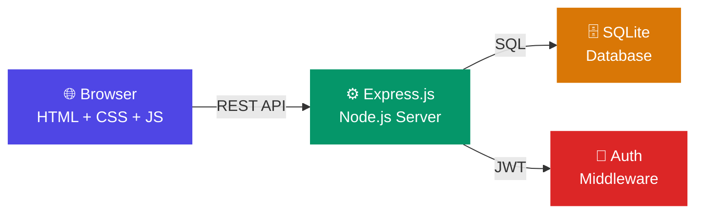

<div align="center">

# 🏢 Leave Management System

### A Modern, Role-Based Employee Leave Management Platform

[](https://nodejs.org/)
[](https://expressjs.com/)
[](https://www.sqlite.org/)
[](https://jwt.io/)
[](LICENSE)

---

**Digitize your leave workflow** — from application to approval — with real-time tracking, role-based dashboards, and beautiful analytics.

[🚀 Quick Start](#-quick-start) · [📖 Documentation](#-documentation) · [✨ Features](#-features) · [🏗️ Architecture](#️-architecture)

</div>

---

## ✨ Features

<table>
<tr>
<td width="50%">

### 👤 Employee Portal
- ✅ Apply for leave (Casual, Sick, Earned, Unpaid)
- ✅ Track leave request status in real-time
- ✅ View leave balance with visual indicators
- ✅ Cancel pending requests
- ✅ Personal dashboard with quick actions

</td>
<td width="50%">

### 👔 Manager Console
- ✅ Review pending leave requests from direct reports
- ✅ Approve or reject with comments
- ✅ Team availability overview
- ✅ Pending request badge notifications
- ✅ Approval audit trail

</td>
</tr>
<tr>
<td width="50%">

### 🛡️ Admin Panel
- ✅ Full employee CRUD management
- ✅ Role & department assignment
- ✅ Organization-wide statistics
- ✅ Leave balance management
- ✅ System-wide analytics dashboard

</td>
<td width="50%">

### 📊 Analytics Dashboard
- ✅ Leave statistics cards with live data
- ✅ Department-wise leave distribution
- ✅ Monthly leave trend charts
- ✅ Role-based view customization
- ✅ Color-coded status indicators

</td>
</tr>
</table>

---

## 🎨 Design Philosophy

> **Premium. Dark. Alive.**

The UI is built with a **modern dark theme** featuring:

| Element | Style |
|---------|-------|
| 🌑 **Background** | Deep navy gradient (`#0f0f23` → `#1a1a3e`) |
| 🪟 **Cards** | Glassmorphism with backdrop blur |
| 💜 **Primary** | Electric Indigo `#4F46E5` |
| 💚 **Success** | Emerald `#10B981` |
| 🟡 **Warning** | Amber `#F59E0B` |
| 🔴 **Danger** | Rose `#F43F5E` |
| 🔤 **Typography** | [Inter](https://fonts.google.com/specimen/Inter) — clean & modern |
| ✨ **Animations** | Smooth micro-interactions & hover effects |

---

## 🏗️ Architecture



| Layer | Technology | Purpose |
|-------|-----------|---------|
| **Frontend** | HTML5 + CSS3 + Vanilla JS | Zero-dependency, fast, responsive UI |
| **Backend** | Node.js + Express.js | RESTful API server |
| **Database** | SQLite (better-sqlite3) | Zero-config, file-based, ACID compliant |
| **Auth** | JWT + bcryptjs | Stateless authentication & secure passwords |

---

## 🚀 Quick Start

### Prerequisites

- [Node.js](https://nodejs.org/) v18 or higher
- npm (comes with Node.js)

### Installation

```bash
# 1. Clone the repository
git clone https://github.com/your-username/Bookflow-management.git
cd Bookflow-management

# 2. Install dependencies
cd server
npm install

# 3. Seed the database with demo data
npm run seed

# 4. Start the server
npm start
```

### 🌐 Open in Browser

```
http://localhost:3000
```

That's it! No database setup, no environment variables, no build step. 🎉

---

## 🔑 Demo Credentials

| Role | Email | Password |
|:----:|-------|:--------:|
| 🛡️ **Admin** | `admin@company.com` | `password123` |
| 👔 **Manager** | `alice@company.com` | `password123` |
| 👔 **Manager** | `bob@company.com` | `password123` |
| 👤 **Employee** | `john@company.com` | `password123` |
| 👤 **Employee** | `jane@company.com` | `password123` |
| 👤 **Employee** | `charlie@company.com` | `password123` |
| 👤 **Employee** | `diana@company.com` | `password123` |
| 👤 **Employee** | `eve@company.com` | `password123` |

---

## 📂 Project Structure

```
Bookflow-management/
│
├── 📁 docs/                          # 📖 Project documentation
│   ├── 01-PRD.md                     #    Product Requirements Document
│   ├── 02-User-Stories.md            #    User Stories & Acceptance Criteria
│   ├── 03-User-Flows.md             #    Flow Diagrams (Mermaid)
│   ├── 04-HLD.md                     #    High Level Design & Architecture
│   ├── 05-LLD.md                     #    Low Level Design & DB Schema
│   ├── 06-API-Documentation.md       #    REST API Reference
│   ├── 07-Wireframes.md             #    UI Wireframes
│   └── 08-Test-Plan.md              #    Test Cases & Bug Templates
│
├── 📁 server/                        # ⚙️ Backend application
│   ├── index.js                      #    Express server entry point
│   ├── package.json                  #    Dependencies & scripts
│   ├── 📁 db/
│   │   ├── schema.sql                #    Database DDL
│   │   ├── seed.js                   #    Demo data seeder
│   │   └── database.js               #    DB connection & helpers
│   ├── 📁 middleware/
│   │   └── auth.js                   #    JWT auth & RBAC middleware
│   └── 📁 routes/
│       ├── auth.js                   #    Login & Registration
│       ├── leaves.js                 #    Leave CRUD & Approvals
│       ├── dashboard.js              #    Statistics & Analytics
│       └── employees.js             #    Admin Employee Management
│
├── 📁 public/                        # 🌐 Frontend application
│   ├── index.html                    #    Login page
│   ├── dashboard.html                #    Main application shell
│   ├── 📁 css/
│   │   └── styles.css                #    Design system & components
│   └── 📁 js/
│       ├── app.js                    #    SPA router & shared logic
│       ├── auth.js                   #    Authentication handling
│       ├── leave.js                  #    Leave application & history
│       ├── manager.js                #    Manager approval panel
│       ├── admin.js                  #    Admin employee management
│       └── dashboard.js             #    Charts & statistics
│
├── .gitignore
├── LICENSE
└── README.md                         # ← You are here!
```

---

## 📖 Documentation

All project documentation lives in the [`docs/`](docs/) folder, organized by role:

### 📋 Product Manager Deliverables
| # | Document | Description |
|:-:|----------|-------------|
| 1 | [PRD](docs/01-PRD.md) | Problem statement, scope, user roles & permissions matrix |
| 2 | [User Stories](docs/02-User-Stories.md) | 17 user stories with acceptance criteria & priority |
| 3 | [User Flows](docs/03-User-Flows.md) | Mermaid flowcharts & sequence diagrams |

### 🔧 Developer Deliverables
| # | Document | Description |
|:-:|----------|-------------|
| 4 | [HLD](docs/04-HLD.md) | Architecture diagrams, module breakdown, tech stack |
| 5 | [LLD](docs/05-LLD.md) | ER diagram, database schema, detailed module design |
| 6 | [API Docs](docs/06-API-Documentation.md) | Full REST API reference with examples |
| 7 | [Wireframes](docs/07-Wireframes.md) | ASCII wireframes for all pages |

### 🧪 Tester Deliverables
| # | Document | Description |
|:-:|----------|-------------|
| 8 | [Test Plan](docs/08-Test-Plan.md) | 45 test scenarios, detailed test cases, bug report templates |

---

## 🔌 API Overview

```
POST   /api/auth/login          →  Authenticate & get JWT
POST   /api/auth/register       →  Create employee (Admin)
                                    
POST   /api/leaves              →  Apply for leave
GET    /api/leaves              →  View leave history
GET    /api/leaves/balance      →  Check leave balance
PUT    /api/leaves/:id/cancel   →  Cancel pending leave
                                    
GET    /api/leaves/pending      →  Pending requests (Manager)
PUT    /api/leaves/:id/approve  →  Approve leave (Manager)
PUT    /api/leaves/:id/reject   →  Reject leave (Manager)
                                    
GET    /api/dashboard/stats     →  Dashboard statistics
                                    
GET    /api/employees           →  List employees (Admin)
POST   /api/employees           →  Add employee (Admin)
PUT    /api/employees/:id       →  Update employee (Admin)
DELETE /api/employees/:id       →  Deactivate employee (Admin)
```

> 📄 Full API documentation with request/response examples: [API Docs](docs/06-API-Documentation.md)

---

## 🛡️ Security

| Concern | Implementation |
|---------|---------------|
| 🔒 Passwords | bcrypt hashed with salt rounds |
| 🎫 Sessions | JWT tokens with 24h expiration |
| 🚪 Authorization | Role-based middleware on every endpoint |
| 💉 SQL Injection | Parameterized queries (prepared statements) |
| 🛡️ XSS | Input sanitization |
| 🌐 CORS | Same-origin (frontend served by Express) |

---

## 🗓️ Development Roadmap

- [x] 📋 Requirements & Documentation (PRD, User Stories, Flows)
- [x] 🏗️ System Design (HLD, LLD, ER Diagram)
- [x] 📝 API Design & Documentation
- [x] 🎨 UI Wireframes
- [x] 🧪 Test Plan & Cases
- [ ] ⚙️ Backend Development
- [ ] 🌐 Frontend Development
- [ ] 🧪 Testing & Bug Fixes
- [ ] 🚀 Deployment

---

## 🤝 Contributing

1. Fork the repository
2. Create your feature branch (`git checkout -b feature/amazing-feature`)
3. Commit your changes (`git commit -m 'Add amazing feature'`)
4. Push to the branch (`git push origin feature/amazing-feature`)
5. Open a Pull Request

---

## 📄 License

This project is licensed under the MIT License — see the [LICENSE](LICENSE) file for details.

---

<div align="center">

**Built with ❤️ for learning real-world software development**

*Leave Management System — Internship Project 2026*

</div>