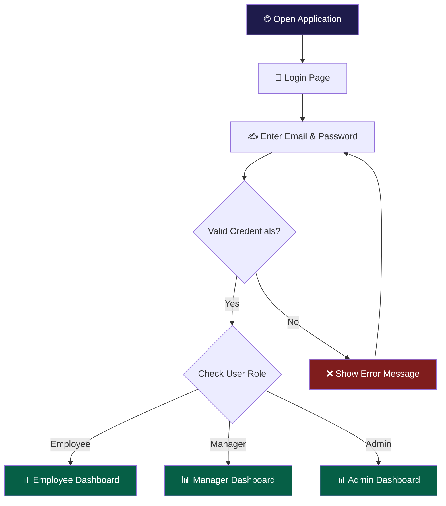
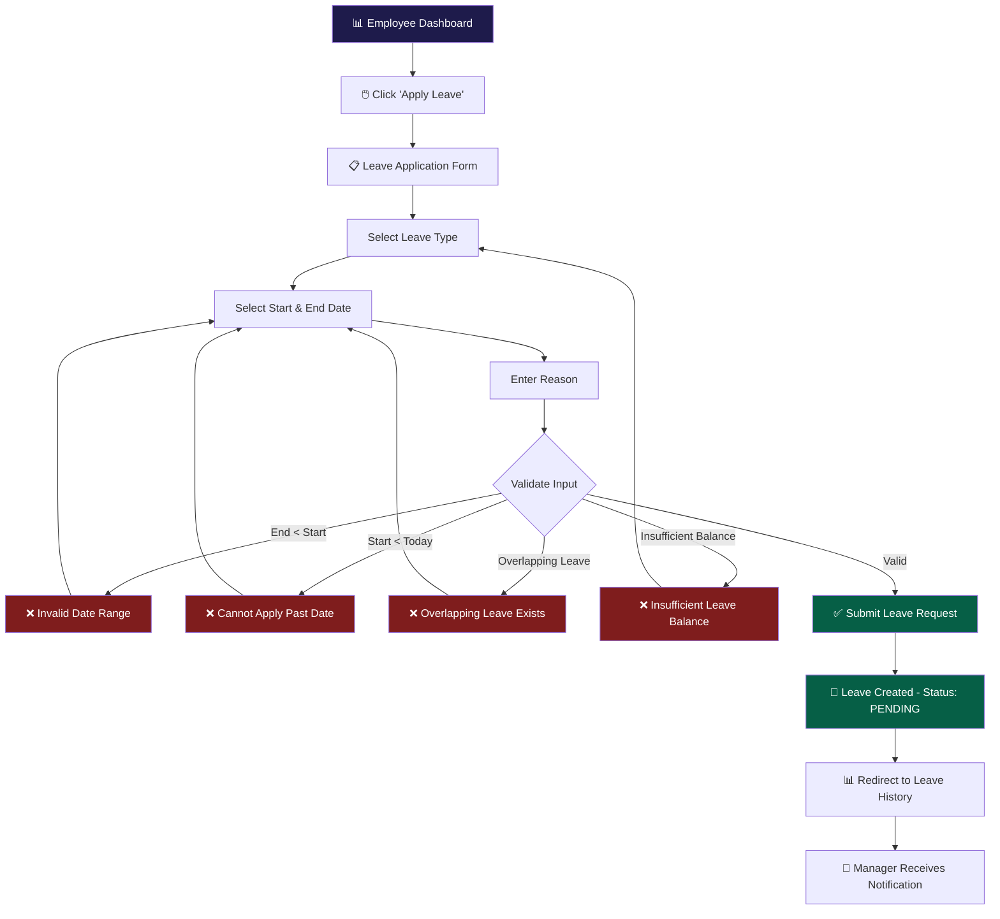
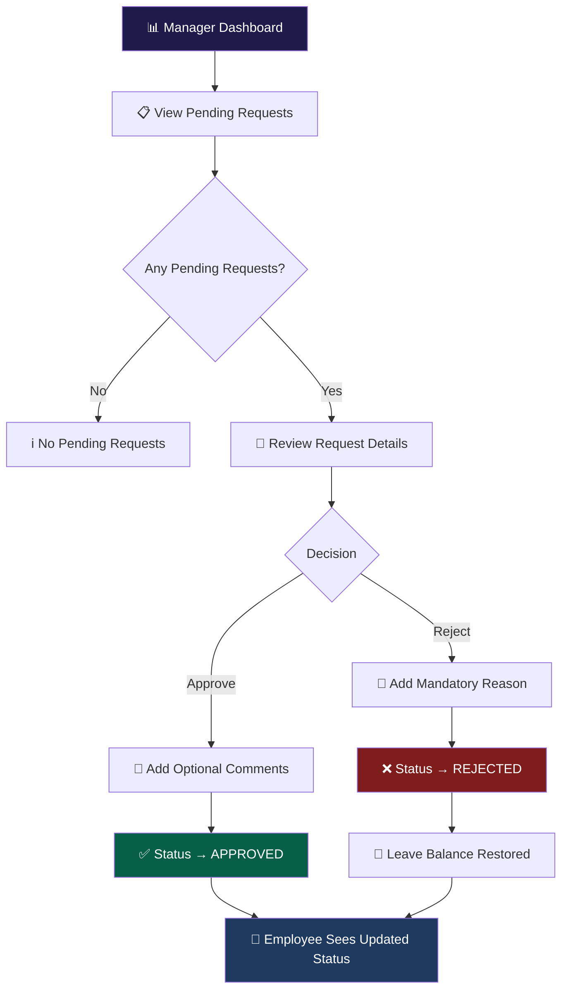
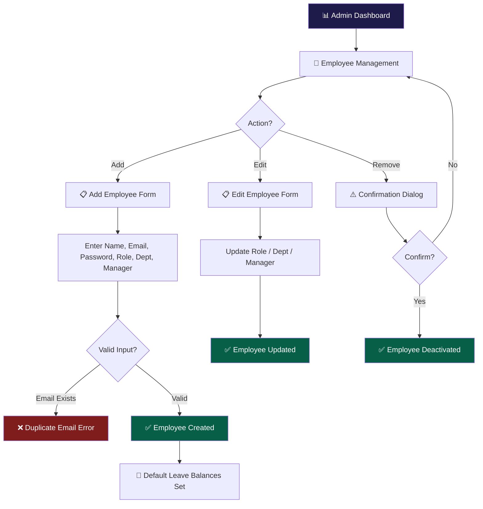
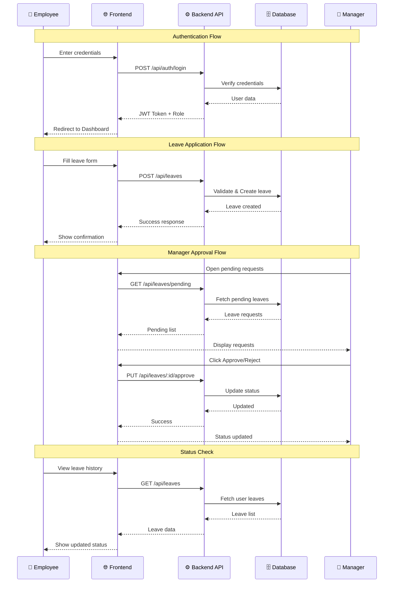
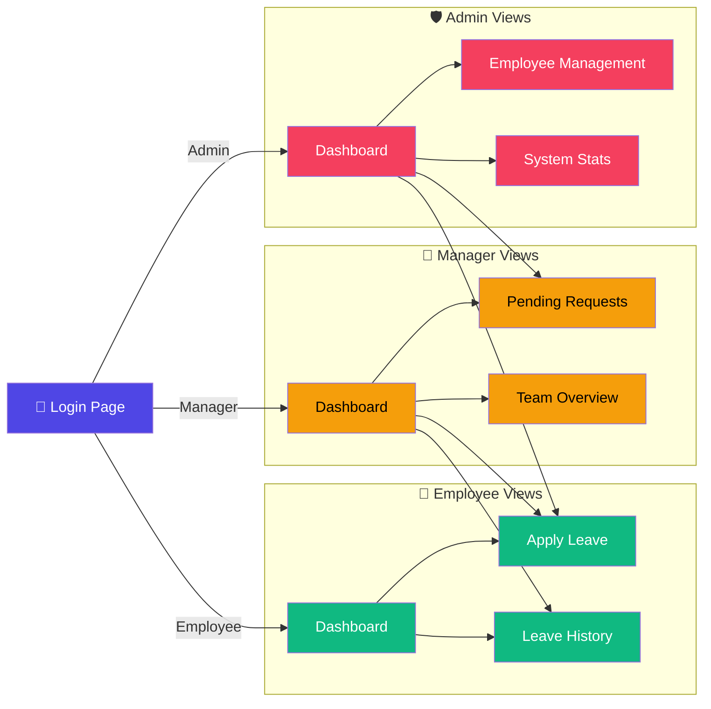

# User Flows
## Leave Management System

**Version:** 1.0  
**Date:** June 2026  

---

## 1. Employee — Login Flow

---

## 2. Employee — Apply Leave Flow

---

## 3. Manager — Approval Flow

---

## 4. Admin — Employee Management Flow

---

## 5. Complete System — Sequence Diagram

---

## 6. Navigation Map

