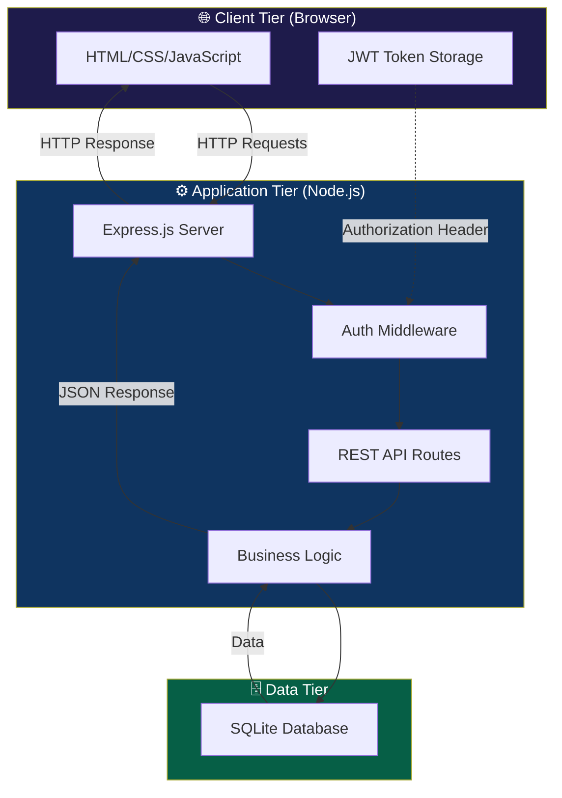
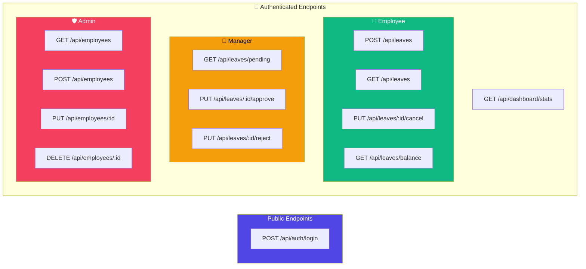
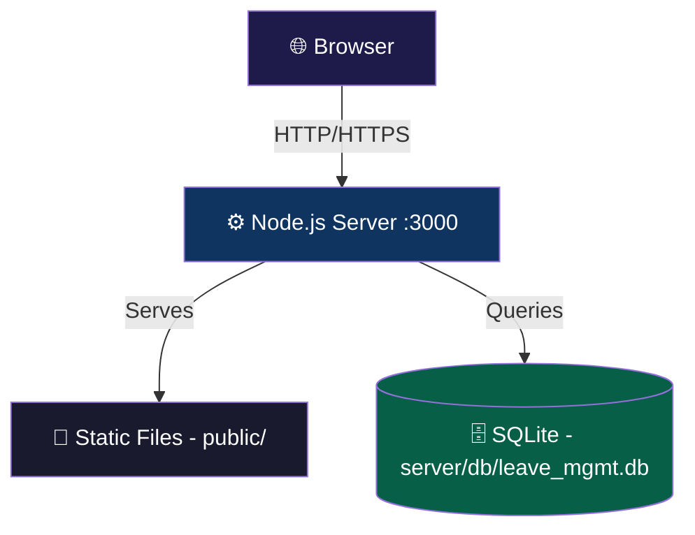

# High Level Design (HLD)
## Leave Management System

**Version:** 1.0  
**Date:** June 2026  

---

## 1. System Architecture

The Leave Management System follows a **3-tier architecture** pattern:

---

## 2. Technology Stack

| Layer | Technology | Version | Justification |
|-------|-----------|---------|---------------|
| **Frontend** | HTML5 + CSS3 + JavaScript (ES6+) | Latest | No build tools needed, fast development, universal browser support |
| **Backend** | Node.js + Express.js | Node 18+, Express 4.x | Lightweight, fast I/O, huge ecosystem, easy REST APIs |
| **Database** | SQLite via `better-sqlite3` | 3.x | Zero-config, file-based, ACID compliant, perfect for single-server deployment |
| **Authentication** | JWT (`jsonwebtoken`) | 9.x | Stateless authentication, no session store needed |
| **Password Hashing** | bcryptjs | 2.x | Industry-standard password hashing |
| **Server** | Express static middleware | — | Serves frontend files directly, no separate web server needed |

---

## 3. Module Breakdown

```mermaid
graph TD
    LMS["Leave Management System"]
    
    LMS --> M1["🔐 Authentication Module"]
    LMS --> M2["📋 Leave Management Module"]
    LMS --> M3["✅ Approval Management Module"]
    LMS --> M4["📊 Dashboard Module"]
    LMS --> M5["👥 Admin Module"]
    
    M1 --> M1A[Login / Logout]
    M1 --> M1B[JWT Token Management]
    M1 --> M1C[Role-Based Access Control]
    
    M2 --> M2A[Apply Leave]
    M2 --> M2B[View Leave History]
    M2 --> M2C[Cancel Leave]
    M2 --> M2D[Leave Balance Tracking]
    
    M3 --> M3A[View Pending Requests]
    M3 --> M3B[Approve Request]
    M3 --> M3C[Reject Request]
    M3 --> M3D[Approval History]
    
    M4 --> M4A[Leave Statistics]
    M4 --> M4B[Department Analysis]
    M4 --> M4C[Monthly Trends]
    
    M5 --> M5A[Employee CRUD]
    M5 --> M5B[Role Management]
    M5 --> M5C[Balance Management]
    
    style LMS fill:#4F46E5,color:#fff
    style M1 fill:#7C3AED,color:#fff
    style M2 fill:#2563EB,color:#fff
    style M3 fill:#059669,color:#fff
    style M4 fill:#D97706,color:#fff
    style M5 fill:#DC2626,color:#fff
```

---

## 4. Module Descriptions

### 4.1 🔐 Authentication Module
**Responsibility:** Manage user identity and access control.

| Component | Description |
|-----------|------------|
| Login | Validates credentials, issues JWT token |
| Logout | Clears client-side token |
| Auth Middleware | Validates JWT on every API request, extracts user info |
| RBAC | Restricts API endpoints based on user role |

### 4.2 📋 Leave Management Module
**Responsibility:** Handle the entire leave lifecycle from application to tracking.

| Component | Description |
|-----------|------------|
| Apply Leave | Validates dates, checks balance, creates leave request |
| Leave History | Returns all leaves for current user with filters |
| Cancel Leave | Cancels pending leave, restores balance |
| Balance Tracker | Maintains per-type leave balance per employee per year |

### 4.3 ✅ Approval Management Module
**Responsibility:** Enable managers to act on leave requests.

| Component | Description |
|-----------|------------|
| Pending Queue | Fetches pending leaves from direct reports |
| Approve | Updates status, records approval with comments |
| Reject | Updates status, records rejection with reason, restores balance |

### 4.4 📊 Dashboard Module
**Responsibility:** Aggregate and present leave analytics.

| Component | Description |
|-----------|------------|
| Personal Stats | Leave balance, recent requests for employees |
| Team Stats | Team availability, pending count for managers |
| System Stats | Organization-wide trends, department breakdowns for admin |

### 4.5 👥 Admin Module
**Responsibility:** User and system management.

| Component | Description |
|-----------|------------|
| Employee CRUD | Add, edit, deactivate employees |
| Role Management | Assign/change employee roles and managers |
| Balance Reset | Reset leave balances for new year |

---

## 5. API Architecture

---

## 6. Deployment Architecture

**Deployment is simple:**
1. Install Node.js
2. Run `npm install` in `server/`
3. Run `npm start` → server starts on port 3000
4. Open `http://localhost:3000` in browser

---

## 7. Security Considerations

| Concern | Mitigation |
|---------|-----------|
| **Password Storage** | bcrypt hashing with salt rounds |
| **Authentication** | JWT tokens with expiration |
| **Authorization** | Role-based middleware on every endpoint |
| **SQL Injection** | Parameterized queries (prepared statements) |
| **XSS** | Input sanitization, Content-Security-Policy |
| **CORS** | Restricted to same-origin (frontend served by same server) |
