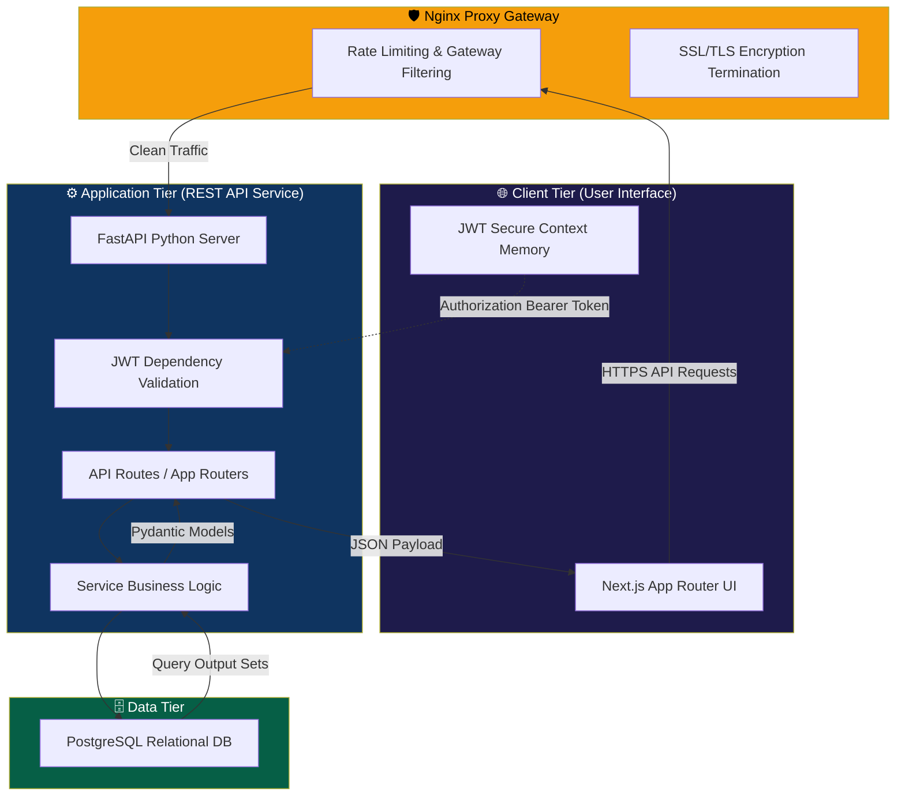
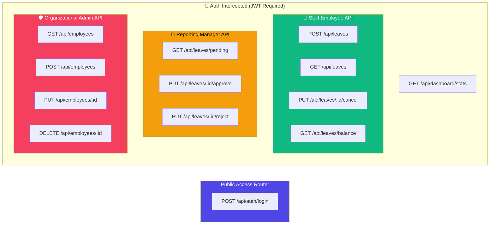
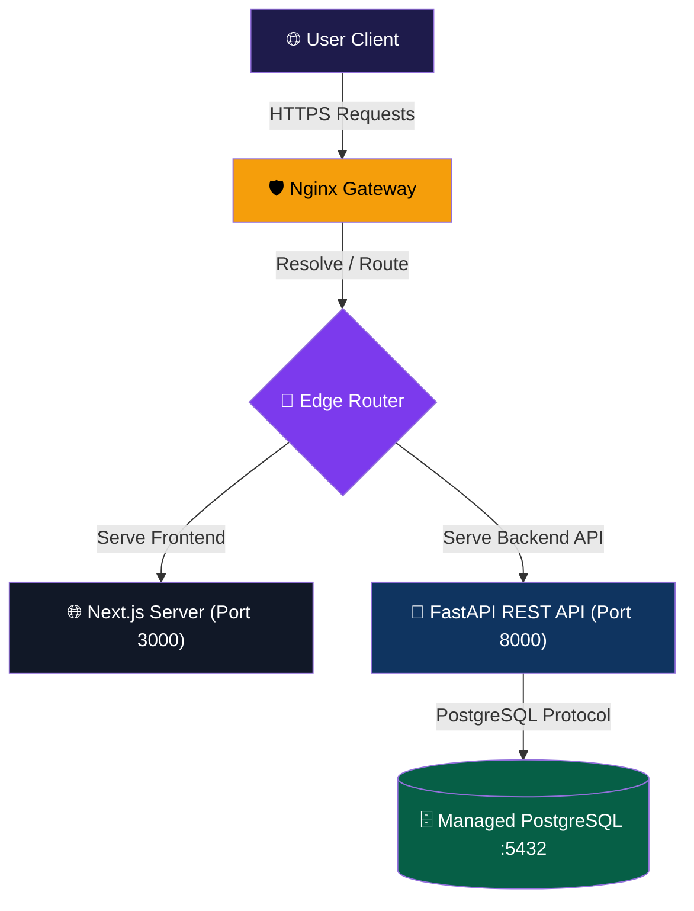

# High Level Design (HLD)
## Leave Management System

**Version:** 1.0  
**Date:** June 2026  

---

## 1. System Architecture

The Leave Management System is designed as a **3-tier system** engineered for maximum scalability, clean separation of concerns, and robust host-level security.

---

## 2. Technology Stack

| Layer | Technology | Target Version | Architectural Justification |
|-------|-----------|----------------|-----------------------------|
| **Frontend** | Next.js (React) + Modern CSS3 | Next.js 14/15+, React 19+ | SEO optimized, modular App Router, high performance caching, and layout inheritance. |
| **Backend** | Python + FastAPI | Python 3.10+, FastAPI 0.110+ | Ultra-fast execution, native asynchronous syntax, autogenerated OpenAPI Swagger documents, Pydantic type safety. |
| **Database** | PostgreSQL relational database | PostgreSQL 15+ | ACID compliance for atomic leave balance updates, relational schema enforcement, robust check constraints. |
| **Database Driver**| asyncpg / psycopg3 | — | Asynchronous communication wrapper with PostgreSQL for optimized concurrent throughput. |
| **Authentication** | JWT Bearer Authentication | PyJWT 2.x | Stateless secure session validation, lightweight payload structure. |
| **Password Hashing**| passlib (bcrypt engine) | Passlib 1.7+ | Dynamic cryptographic salting, resilient against catalog search or brute-forcing. |
| **Network & Gateway**| Nginx Reverse Proxy | v1.24+ | Rate limiting, SSL/TLS termination, port-hiding gateway, and security header injection. |

---

## 3. Module Breakdown

```mermaid
graph TD
    LMS["Leave Management System"]
    
    LMS --> M1["🔐 Authentication Module"]
    LMS --> M2["📋 Leave Management Module"]
    LMS --> M3["✅ Approval Management Module"]
    LMS --> M4["📊 Dashboard Module"]
    LMS --> M5["👥 Admin Module"]
    
    M1 --> M1A[Login / Logout]
    M1 --> M1B[JWT Dependency Validation]
    M1 --> M1C[Role-Based Access Control]
    
    M2 --> M2A[Apply Leave]
    M2 --> M2B[View Leave History]
    M2 --> M2C[Cancel Leave]
    M2 --> M2D[Leave Balance Tracking]
    
    M3 --> M3A[View Pending Requests]
    M3 --> M3B[Approve Request]
    M3 --> M3C[Reject Request]
    M3 --> M3D[Approval Audit Logs]
    
    M4 --> M4A[Leave Statistics]
    M4 --> M4B[Department Analysis]
    M4 --> M4C[Monthly Trends]
    
    M5 --> M5A[Employee CRUD]
    M5 --> M5B[Role Management]
    M5 --> M5C[Balance Quotas Management]
    
    style LMS fill:#4F46E5,color:#fff
    style M1 fill:#7C3AED,color:#fff
    style M2 fill:#2563EB,color:#fff
    style M3 fill:#059669,color:#fff
    style M4 fill:#D97706,color:#fff
    style M5 fill:#DC2626,color:#fff
```

---

## 4. Module Descriptions

### 4.1 🔐 Authentication Module
**Responsibility:** Validate identities, secure endpoints, and enforce privileges.

| Sub-Component | Detailed Operations |
|---------------|---------------------|
| Login Controller | Compares user credentials with DB hashes, generates signed asymmetric/symmetric JWT. |
| Logout Controller | Commands client state clear of JWT tokens in context memory. |
| Auth Dependency | Intercepts HTTP Authorization header, decodes JWT, registers user model parameters. |
| RBAC Guard | Rejects queries with a `403 Forbidden` response if the decrypted user role doesn't have permissions. |

### 4.2 📋 Leave Management Module
**Responsibility:** Handle the complete lifecycle of leave records.

| Sub-Component | Detailed Operations |
|---------------|---------------------|
| Apply Leave Router | Validates submission dates, verifies balance quotas, prevents overlaps, records request. |
| History Fetcher | Queries personal leave logs with status queries and pagination support. |
| Cancel Leave API | Sets a pending request's status to `cancelled` and restores any cached balances. |
| Balance Engine | Keeps record of remaining Casual, Sick, and Earned leaves per year per user. |

### 4.3 ✅ Approval Management Module
**Responsibility:** Enable managers to act upon pending submissions.

| Sub-Component | Detailed Operations |
|---------------|---------------------|
| Request Queue | Lists all leaves marked `pending` where applicant's `manager_id` matches the current reviewer. |
| Approve Router | Changes leave status to `approved`, creates approval log entry, commits transaction. |
| Reject Router | Updates leave status to `rejected`, restores leave balance, files mandatory rejection feedback comments. |

### 4.4 📊 Dashboard Module
**Responsibility:** Aggregate statistics and deliver role-specific dashboards.

| Sub-Component | Detailed Operations |
|---------------|---------------------|
| Employee Dashboard | Renders quick balance counters, status distributions, and recent histories. |
| Manager Dashboard | Identifies current team absences, pending queues, and active summaries. |
| Admin Dashboard | Calculates organizational statistics, monthly trends, and department-wise divisions. |

### 4.5 👥 Admin Module
**Responsibility:** Orchestrate staff members profiles and system parameters.

| Sub-Component | Detailed Operations |
|---------------|---------------------|
| Employee CRUD | Enables creating, editing, viewing, and soft-deactivating users. |
| Manager Linking | Connects employees to their reporting line managers. |
| Quota Initialization | Configures yearly leave balances automatically for newly registered employees. |

---

## 5. API Architecture Layout

---

## 6. Deployment Architecture

### Deployment Steps (Production Guide)
1. **Server Setup**: Set up virtual servers or hosting nodes for the Next.js frontend and FastAPI backend.
2. **PostgreSQL Setup**: Install and run a PostgreSQL 15+ database (local instance or cloud-managed, e.g., Supabase/RDS). Create the application database: `createdb leave_management`.
3. **Backend Deployment**:
   - Install Python 3.10+ and set up a virtual environment: `python -m venv venv`.
   - Activate environment and install dependencies: `pip install -r server/requirements.txt`.
   - Setup configuration in `server/.env` (DB URL, JWT Secret, Host, Ports).
   - Seed initial database structures and demo data: `python server/db/seed.py`.
   - Start the production ASGI web server: `uvicorn main:app --host 0.0.0.0 --port 8000`.
4. **Frontend Deployment**:
   - Install Node.js 18+.
   - Setup configuration environment files `client/.env.local` to point towards the backend API route.
   - Install JavaScript dependencies: `cd client && npm install`.
   - Run compilation build: `npm run build`.
   - Run the production Next.js runner: `npm run start -- -p 3000`.
5. **Security Integration**: Configure Nginx server blocks to proxy traffic to port 8000 and setup SSL/TLS encryption via Let's Encrypt.

---

## 7. Security Design Considerations

| Vulnerability Target | Design Countermeasure / Mitigation Strategy |
|----------------------|---------------------------------------------|
| **DDoS Attacks** | Rate limiting at Nginx layer, connection pooling, and standard OS firewall (UFW/iptables) rules. |
| **API Automated Abuse** | Rate limits set up at Nginx proxy gateway (30 req/min on auth routes) to prevent bot scanning. |
| **Data Leakage (Transit)** | Full SSL/TLS (Strict Encryption Mode) via Nginx Let's Encrypt certificates. |
| **Access Escalation** | Custom FastAPI dependencies checking roles and IDs on *every single request* before executing query models. |
| **SQL Injection (SQLi)** | Parameterized and prepared queries utilizing asyncpg/psycopg database models. Direct raw string interpolation is strictly prohibited. |
| **XSS Attacks** | Next.js auto-escapes rendered templates natively. High-grade Content-Security-Policy (CSP) headers configured at Nginx and application routing layer. |
| **CSRF Attacks** | Protected by using authorization Bearer tokens in headers instead of relying entirely on standard session cookies without verification. |

---

> 📄 For further technology definitions, see: [Technology Requirements Document (TRD)](02-TRD.md)
