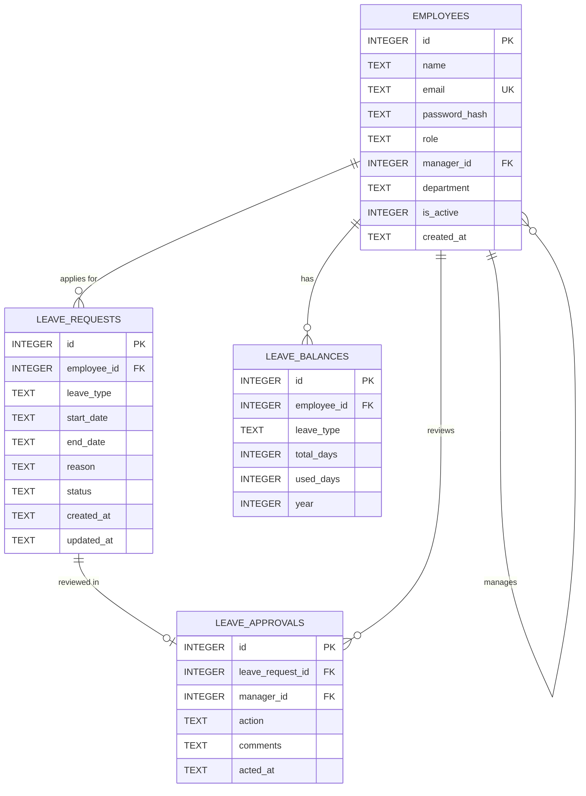

# Low Level Design (LLD)
## Leave Management System

**Version:** 1.0  
**Date:** June 2026  

---

## 1. Entity Relationship Diagram



---

## 2. Database Schema

### 2.1 `employees` Table

Stores all user accounts — employees, managers, and admins.

| Column | Type | Constraints | Description |
|--------|------|------------|-------------|
| `id` | INTEGER | PRIMARY KEY, AUTOINCREMENT | Unique employee ID |
| `name` | TEXT | NOT NULL | Full name |
| `email` | TEXT | NOT NULL, UNIQUE | Login email |
| `password_hash` | TEXT | NOT NULL | bcrypt hashed password |
| `role` | TEXT | NOT NULL, CHECK(role IN ('employee','manager','admin')) | System role |
| `manager_id` | INTEGER | REFERENCES employees(id), NULLABLE | Reporting manager (NULL for admins) |
| `department` | TEXT | NOT NULL, DEFAULT 'General' | Department name |
| `is_active` | INTEGER | NOT NULL, DEFAULT 1 | 1 = active, 0 = deactivated |
| `created_at` | TEXT | NOT NULL, DEFAULT CURRENT_TIMESTAMP | Account creation time |

**Indexes:**
- `idx_employees_email` on `email`
- `idx_employees_manager_id` on `manager_id`
- `idx_employees_role` on `role`

---

### 2.2 `leave_requests` Table

Stores every leave application submitted by employees.

| Column | Type | Constraints | Description |
|--------|------|------------|-------------|
| `id` | INTEGER | PRIMARY KEY, AUTOINCREMENT | Unique leave request ID |
| `employee_id` | INTEGER | NOT NULL, REFERENCES employees(id) | Applicant |
| `leave_type` | TEXT | NOT NULL, CHECK(leave_type IN ('casual','sick','earned','unpaid')) | Type of leave |
| `start_date` | TEXT | NOT NULL | Leave start (YYYY-MM-DD) |
| `end_date` | TEXT | NOT NULL | Leave end (YYYY-MM-DD) |
| `reason` | TEXT | NOT NULL | Reason for leave |
| `status` | TEXT | NOT NULL, DEFAULT 'pending', CHECK(status IN ('pending','approved','rejected','cancelled')) | Current status |
| `created_at` | TEXT | NOT NULL, DEFAULT CURRENT_TIMESTAMP | Application timestamp |
| `updated_at` | TEXT | NOT NULL, DEFAULT CURRENT_TIMESTAMP | Last status change |

**Indexes:**
- `idx_leaves_employee_id` on `employee_id`
- `idx_leaves_status` on `status`
- `idx_leaves_dates` on `start_date, end_date`

---

### 2.3 `leave_approvals` Table

Records manager actions on leave requests (audit trail).

| Column | Type | Constraints | Description |
|--------|------|------------|-------------|
| `id` | INTEGER | PRIMARY KEY, AUTOINCREMENT | Unique approval record ID |
| `leave_request_id` | INTEGER | NOT NULL, REFERENCES leave_requests(id) | Associated leave request |
| `manager_id` | INTEGER | NOT NULL, REFERENCES employees(id) | Acting manager |
| `action` | TEXT | NOT NULL, CHECK(action IN ('approved','rejected')) | Action taken |
| `comments` | TEXT | NULLABLE | Manager comments/reason |
| `acted_at` | TEXT | NOT NULL, DEFAULT CURRENT_TIMESTAMP | Action timestamp |

**Indexes:**
- `idx_approvals_leave_id` on `leave_request_id`
- `idx_approvals_manager_id` on `manager_id`

---

### 2.4 `leave_balances` Table

Tracks leave quota per employee per leave type per year.

| Column | Type | Constraints | Description |
|--------|------|------------|-------------|
| `id` | INTEGER | PRIMARY KEY, AUTOINCREMENT | Unique balance record ID |
| `employee_id` | INTEGER | NOT NULL, REFERENCES employees(id) | Employee |
| `leave_type` | TEXT | NOT NULL, CHECK(leave_type IN ('casual','sick','earned')) | Leave type (unpaid has no balance) |
| `total_days` | INTEGER | NOT NULL | Total allocated for the year |
| `used_days` | INTEGER | NOT NULL, DEFAULT 0 | Days used so far |
| `year` | INTEGER | NOT NULL | Calendar year |

**Constraints:**
- UNIQUE(`employee_id`, `leave_type`, `year`)

**Indexes:**
- `idx_balances_employee_year` on `employee_id, year`

---

## 3. SQL Schema Definition

```sql
-- Enable foreign keys
PRAGMA foreign_keys = ON;

-- Employees table
CREATE TABLE IF NOT EXISTS employees (
    id INTEGER PRIMARY KEY AUTOINCREMENT,
    name TEXT NOT NULL,
    email TEXT NOT NULL UNIQUE,
    password_hash TEXT NOT NULL,
    role TEXT NOT NULL CHECK(role IN ('employee', 'manager', 'admin')),
    manager_id INTEGER REFERENCES employees(id) ON DELETE SET NULL,
    department TEXT NOT NULL DEFAULT 'General',
    is_active INTEGER NOT NULL DEFAULT 1,
    created_at TEXT NOT NULL DEFAULT CURRENT_TIMESTAMP
);

-- Leave requests table
CREATE TABLE IF NOT EXISTS leave_requests (
    id INTEGER PRIMARY KEY AUTOINCREMENT,
    employee_id INTEGER NOT NULL REFERENCES employees(id) ON DELETE CASCADE,
    leave_type TEXT NOT NULL CHECK(leave_type IN ('casual', 'sick', 'earned', 'unpaid')),
    start_date TEXT NOT NULL,
    end_date TEXT NOT NULL,
    reason TEXT NOT NULL,
    status TEXT NOT NULL DEFAULT 'pending' CHECK(status IN ('pending', 'approved', 'rejected', 'cancelled')),
    created_at TEXT NOT NULL DEFAULT CURRENT_TIMESTAMP,
    updated_at TEXT NOT NULL DEFAULT CURRENT_TIMESTAMP
);

-- Leave approvals table
CREATE TABLE IF NOT EXISTS leave_approvals (
    id INTEGER PRIMARY KEY AUTOINCREMENT,
    leave_request_id INTEGER NOT NULL REFERENCES leave_requests(id) ON DELETE CASCADE,
    manager_id INTEGER NOT NULL REFERENCES employees(id),
    action TEXT NOT NULL CHECK(action IN ('approved', 'rejected')),
    comments TEXT,
    acted_at TEXT NOT NULL DEFAULT CURRENT_TIMESTAMP
);

-- Leave balances table
CREATE TABLE IF NOT EXISTS leave_balances (
    id INTEGER PRIMARY KEY AUTOINCREMENT,
    employee_id INTEGER NOT NULL REFERENCES employees(id) ON DELETE CASCADE,
    leave_type TEXT NOT NULL CHECK(leave_type IN ('casual', 'sick', 'earned')),
    total_days INTEGER NOT NULL,
    used_days INTEGER NOT NULL DEFAULT 0,
    year INTEGER NOT NULL,
    UNIQUE(employee_id, leave_type, year)
);

-- Indexes
CREATE INDEX IF NOT EXISTS idx_employees_email ON employees(email);
CREATE INDEX IF NOT EXISTS idx_employees_manager_id ON employees(manager_id);
CREATE INDEX IF NOT EXISTS idx_employees_role ON employees(role);
CREATE INDEX IF NOT EXISTS idx_leaves_employee_id ON leave_requests(employee_id);
CREATE INDEX IF NOT EXISTS idx_leaves_status ON leave_requests(status);
CREATE INDEX IF NOT EXISTS idx_leaves_dates ON leave_requests(start_date, end_date);
CREATE INDEX IF NOT EXISTS idx_approvals_leave_id ON leave_approvals(leave_request_id);
CREATE INDEX IF NOT EXISTS idx_approvals_manager_id ON leave_approvals(manager_id);
CREATE INDEX IF NOT EXISTS idx_balances_employee_year ON leave_balances(employee_id, year);
```

---

## 4. Module Detailed Design

### 4.1 Auth Middleware (`middleware/auth.js`)

```
Function: authenticateToken(req, res, next)
├── Extract JWT from "Authorization: Bearer <token>"
├── If no token → 401 Unauthorized
├── Verify token with secret key
├── If invalid/expired → 403 Forbidden
├── Attach user { id, email, role } to req.user
└── Call next()

Function: requireRole(...roles)
├── Returns middleware function
├── Check if req.user.role is in allowed roles
├── If not → 403 Forbidden
└── Call next()
```

### 4.2 Leave Business Logic (`routes/leaves.js`)

```
Function: applyLeave(employeeId, leaveData)
├── Validate required fields (type, startDate, endDate, reason)
├── Validate endDate >= startDate
├── Validate startDate >= today
├── Check for overlapping leaves (pending/approved)
│   └── SELECT FROM leave_requests WHERE employee_id = ? 
│       AND status IN ('pending', 'approved')
│       AND start_date <= ? AND end_date >= ?
├── If leave_type != 'unpaid':
│   ├── Calculate business days
│   ├── Check leave_balances for sufficient remaining
│   └── Deduct from balance
├── INSERT INTO leave_requests
└── Return created leave

Function: approveLeave(managerId, leaveId)
├── Fetch leave request
├── Verify status is 'pending'
├── Verify managerId is the employee's manager
├── UPDATE leave_requests SET status = 'approved'
├── INSERT INTO leave_approvals
└── Return updated leave

Function: rejectLeave(managerId, leaveId, reason)
├── Fetch leave request
├── Verify status is 'pending'
├── Verify managerId is the employee's manager
├── UPDATE leave_requests SET status = 'rejected'
├── Restore leave balance (if paid leave)
├── INSERT INTO leave_approvals
└── Return updated leave
```

### 4.3 Dashboard Stats (`routes/dashboard.js`)

```
Function: getStats(userId, role)
├── If role == 'employee':
│   ├── Leave balance summary
│   ├── Recent requests (last 5)
│   └── Status counts (pending, approved, rejected)
├── If role == 'manager':
│   ├── Pending approval count
│   ├── Team members on leave today
│   └── Team leave summary
├── If role == 'admin':
│   ├── Organization-wide status counts
│   ├── Department-wise breakdown
│   ├── Monthly trend (last 6 months)
│   └── Employee count by role
└── Return stats object
```

---

## 5. Frontend Module Design

### 5.1 Application Router (`js/app.js`)

```
SPA Navigation:
├── Check JWT token exists → if not, show login
├── Decode token → get user role
├── Render role-appropriate navigation sidebar
├── Handle view switching:
│   ├── 'dashboard' → render dashboard view
│   ├── 'apply-leave' → render leave form
│   ├── 'leave-history' → render leave table
│   ├── 'pending-requests' → render approval queue (manager+)
│   ├── 'employees' → render employee list (admin)
│   └── default → dashboard
└── Each view calls corresponding module

API Helper:
├── apiRequest(method, url, body)
│   ├── Attach Authorization header with JWT
│   ├── Handle 401 → redirect to login
│   ├── Parse JSON response
│   └── Return data or throw error
```

### 5.2 CSS Design System (`css/styles.css`)

```
Design Tokens:
├── Colors: Navy dark mode palette, accent colors
├── Typography: Inter font, size scale
├── Spacing: 4px base unit scale
├── Borders: Radius scale
├── Shadows: Elevation levels
└── Animations: Transitions, keyframes

Components:
├── .card — Glassmorphism container
├── .btn — Button variants (primary, success, danger)
├── .input — Form inputs with focus states
├── .table — Data table with hover rows
├── .badge — Status indicators
├── .sidebar — Navigation sidebar
├── .stat-card — Dashboard statistic card
└── .modal — Overlay dialogs
```
