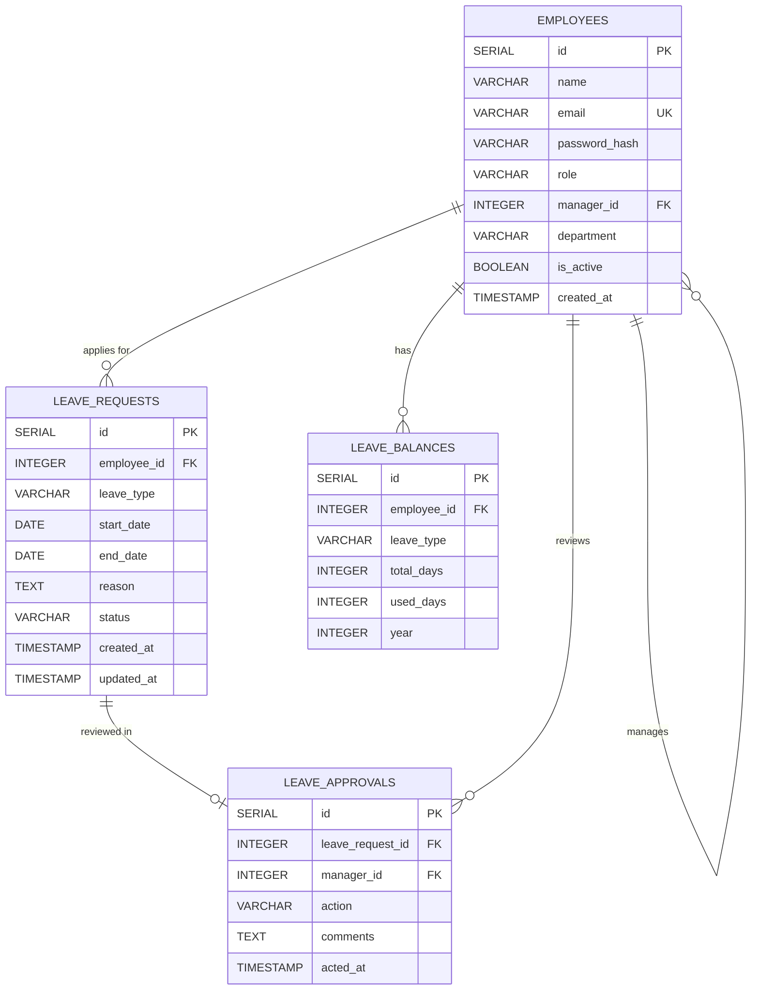

# Low Level Design (LLD)
## Leave Management System

**Version:** 1.0  
**Date:** June 2026  

---

## 1. Entity Relationship Diagram



---

## 2. Database Schema (PostgreSQL)

### 2.1 `employees` Table
Stores user accounts for employees, managers, and admins.

| Column | Type | Constraints | Description |
|--------|------|------------|-------------|
| `id` | SERIAL | PRIMARY KEY | Unique employee ID |
| `name` | VARCHAR(100) | NOT NULL | Full name |
| `email` | VARCHAR(255) | NOT NULL, UNIQUE | Login email address |
| `password_hash` | VARCHAR(255) | NOT NULL | bcrypt hashed password |
| `role` | VARCHAR(20) | NOT NULL, CHECK(role IN ('super_admin','admin','hr','finance','manager','employee')) | System authorization role |
| `manager_id` | INTEGER | REFERENCES employees(id), NULLABLE | Reporting manager ID |
| `department` | VARCHAR(100) | NOT NULL, DEFAULT 'General' | Department group |
| `is_active` | BOOLEAN | NOT NULL, DEFAULT TRUE | Status toggle |
| `created_at` | TIMESTAMP | NOT NULL, DEFAULT NOW() | Record creation date |

**Indexes:**
- `idx_employees_email` on `email`
- `idx_employees_manager_id` on `manager_id`
- `idx_employees_role` on `role`

---

### 2.2 `leave_requests` Table
Stores every leave application submitted by employees.

| Column | Type | Constraints | Description |
|--------|------|------------|-------------|
| `id` | SERIAL | PRIMARY KEY | Unique leave request ID |
| `employee_id` | INTEGER | NOT NULL, REFERENCES employees(id) ON DELETE CASCADE | Associated employee |
| `leave_type` | VARCHAR(20) | NOT NULL, CHECK(leave_type IN ('casual','sick','earned','unpaid')) | Category of leave |
| `start_date` | DATE | NOT NULL | Target starting date |
| `end_date` | DATE | NOT NULL | Target end date |
| `reason` | TEXT | NOT NULL | Employee explanation |
| `status` | VARCHAR(20) | NOT NULL, DEFAULT 'pending', CHECK(status IN ('pending','approved','rejected','cancelled')) | Current workflow status |
| `created_at` | TIMESTAMP | NOT NULL, DEFAULT NOW() | Submission timestamp |
| `updated_at` | TIMESTAMP | NOT NULL, DEFAULT NOW() | Status alteration timestamp |

**Indexes:**
- `idx_leaves_employee_id` on `employee_id`
- `idx_leaves_status` on `status`
- `idx_leaves_dates` on `start_date, end_date`

---

### 2.3 `leave_approvals` Table
Records manager actions on leave requests (audit trail).

| Column | Type | Constraints | Description |
|--------|------|------------|-------------|
| `id` | SERIAL | PRIMARY KEY | Unique approval action ID |
| `leave_request_id` | INTEGER | NOT NULL, REFERENCES leave_requests(id) ON DELETE CASCADE | Target leave request |
| `manager_id` | INTEGER | NOT NULL, REFERENCES employees(id) | Acting manager reviewer |
| `action` | VARCHAR(20) | NOT NULL, CHECK(action IN ('approved','rejected')) | Decision taken |
| `comments` | TEXT | NULLABLE | Decision comments |
| `acted_at` | TIMESTAMP | NOT NULL, DEFAULT NOW() | Evaluation timestamp |

**Indexes:**
- `idx_approvals_leave_id` on `leave_request_id`
- `idx_approvals_manager_id` on `manager_id`

---

### 2.4 `leave_balances` Table
Tracks leave quotas per employee per leave type per year.

| Column | Type | Constraints | Description |
|--------|------|------------|-------------|
| `id` | SERIAL | PRIMARY KEY | Unique balance row ID |
| `employee_id` | INTEGER | NOT NULL, REFERENCES employees(id) ON DELETE CASCADE | Target employee |
| `leave_type` | VARCHAR(20) | NOT NULL, CHECK(leave_type IN ('casual','sick','earned')) | Balance category type |
| `total_days` | INTEGER | NOT NULL | Allocated credit for the calendar year |
| `used_days` | INTEGER | NOT NULL, DEFAULT 0 | Consumed balance |
| `year` | INTEGER | NOT NULL | Calendar year target |

**Constraints:**
- UNIQUE(`employee_id`, `leave_type`, `year`)

**Indexes:**
- `idx_balances_employee_year` on `employee_id, year`

---

## 3. SQL Schema Definition (PostgreSQL)

```sql
-- =======================================================
-- LEAVE MANAGEMENT SYSTEM — POSTGRESQL DDL DEFINITIONS
-- =======================================================

-- Employees table
CREATE TABLE IF NOT EXISTS employees (
    id SERIAL PRIMARY KEY,
    name VARCHAR(100) NOT NULL,
    email VARCHAR(255) NOT NULL UNIQUE,
    password_hash VARCHAR(255) NOT NULL,
    role VARCHAR(20) NOT NULL CHECK (role IN ('super_admin', 'admin', 'hr', 'finance', 'manager', 'employee')),
    manager_id INTEGER REFERENCES employees(id) ON DELETE SET NULL,
    department VARCHAR(100) NOT NULL DEFAULT 'General',
    is_active BOOLEAN NOT NULL DEFAULT TRUE,
    created_at TIMESTAMP NOT NULL DEFAULT NOW()
);

-- Leave requests table
CREATE TABLE IF NOT EXISTS leave_requests (
    id SERIAL PRIMARY KEY,
    employee_id INTEGER NOT NULL REFERENCES employees(id) ON DELETE CASCADE,
    leave_type VARCHAR(20) NOT NULL CHECK (leave_type IN ('casual', 'sick', 'earned', 'unpaid')),
    start_date DATE NOT NULL,
    end_date DATE NOT NULL,
    reason TEXT NOT NULL,
    status VARCHAR(20) NOT NULL DEFAULT 'pending' CHECK (status IN ('pending', 'approved', 'rejected', 'cancelled')),
    created_at TIMESTAMP NOT NULL DEFAULT NOW(),
    updated_at TIMESTAMP NOT NULL DEFAULT NOW()
);

-- Leave approvals table (audit trail)
CREATE TABLE IF NOT EXISTS leave_approvals (
    id SERIAL PRIMARY KEY,
    leave_request_id INTEGER NOT NULL REFERENCES leave_requests(id) ON DELETE CASCADE,
    manager_id INTEGER NOT NULL REFERENCES employees(id),
    action VARCHAR(20) NOT NULL CHECK (action IN ('approved', 'rejected')),
    comments TEXT,
    acted_at TIMESTAMP NOT NULL DEFAULT NOW()
);

-- Leave balances table
CREATE TABLE IF NOT EXISTS leave_balances (
    id SERIAL PRIMARY KEY,
    employee_id INTEGER NOT NULL REFERENCES employees(id) ON DELETE CASCADE,
    leave_type VARCHAR(20) NOT NULL CHECK (leave_type IN ('casual', 'sick', 'earned')),
    total_days INTEGER NOT NULL,
    used_days INTEGER NOT NULL DEFAULT 0,
    year INTEGER NOT NULL,
    UNIQUE(employee_id, leave_type, year)
);

-- Indexes for optimized query execution
CREATE INDEX IF NOT EXISTS idx_employees_email ON employees(email);
CREATE INDEX IF NOT EXISTS idx_employees_manager_id ON employees(manager_id);
CREATE INDEX IF NOT EXISTS idx_employees_role ON employees(role);
CREATE INDEX IF NOT EXISTS idx_leaves_employee_id ON leave_requests(employee_id);
CREATE INDEX IF NOT EXISTS idx_leaves_status ON leave_requests(status);
CREATE INDEX IF NOT EXISTS idx_leaves_dates ON leave_requests(start_date, end_date);
CREATE INDEX IF NOT EXISTS idx_approvals_leave_id ON leave_approvals(leave_request_id);
CREATE INDEX IF NOT EXISTS idx_approvals_manager_id ON leave_approvals(manager_id);
CREATE INDEX IF NOT EXISTS idx_balances_employee_year ON leave_balances(employee_id, year);

-- Auto-update updated_at modifier function
CREATE OR REPLACE FUNCTION update_updated_at()
RETURNS TRIGGER AS $$
BEGIN
    NEW.updated_at = NOW();
    RETURN NEW;
END;
$$ LANGUAGE plpgsql;

CREATE TRIGGER trg_leave_requests_updated_at
    BEFORE UPDATE ON leave_requests
    FOR EACH ROW
    EXECUTE FUNCTION update_updated_at();
```

---

## 4. Backend Module Detailed Design (Python & FastAPI)

### 4.1 Dependency Injection & JWT Validation (`server/app/dependencies.py`)

Using FastAPI dependencies, authentication and authorization are handled in a clean, reusable pipeline:

```python
# Pseudo-code implementation design for authentication dependencies
async def get_current_user(token: str = Depends(oauth2_scheme), db: AsyncSession = Depends(get_db)):
    """
    1. Intercept Token from request headers (Bearer token)
    2. Try to decode the token with JWT_SECRET and algorithm HS256
    3. If verification fails (expired or tempered token) -> Raise HTTP 401 Unauthorized
    4. Extract payload: {"sub": user_email, "id": user_id, "role": user_role}
    5. Query user from DB. If user is None or user.is_active is False -> Raise HTTP 401
    6. Return current active user object.
    """
    pass

class RoleChecker:
    """
    Dependency to enforce Role-Based Access Control (RBAC) at routing layers:
    """
    def __init__(self, allowed_roles: list[str]):
        self.allowed_roles = allowed_roles
        
    def __call__(self, current_user: User = Depends(get_current_user)):
        if current_user.role not in self.allowed_roles:
            raise HTTPException(status_code=403, detail="Operation forbidden: Insufficient privileges")
        return current_user
```

### 4.2 Leave Business Logic (`server/app/routes/leaves.py`)

```python
# Async business logic structure for leave management APIs

async def create_leave_request(request: LeaveCreateSchema, user: User, db: AsyncSession):
    # 1. Date Range Validations
    if request.start_date < datetime.date.today():
        raise HTTPException(400, "Start date cannot be in the past")
    if request.end_date < request.start_date:
        raise HTTPException(400, "End date must be on or after start date")
        
    # 2. Check overlap absences
    overlaps = await query_overlapping_leaves(user.id, request.start_date, request.end_date, db)
    if overlaps:
        raise HTTPException(400, "You already have overlapping leaves filed for this period")
        
    # 3. Balance verification for paid leaves
    if request.leave_type != "unpaid":
        requested_days = calculate_business_days(request.start_date, request.end_date)
        balance = await get_leave_balance(user.id, request.leave_type, datetime.date.today().year, db)
        
        if not balance or (balance.total_days - balance.used_days) < requested_days:
            raise HTTPException(400, "Sufficient balance is unavailable for this leave type")
            
        # Deduct balance immediately in pending state to secure the quota
        await deduct_leave_balance(balance, requested_days, db)
        
    # 4. Insert request
    new_request = LeaveRequest(employee_id=user.id, **request.dict(), status="pending")
    db.add(new_request)
    await db.commit()
    return new_request

async def review_leave_request(leave_id: int, action: str, comments: str, manager: User, db: AsyncSession):
    # 1. Fetch target leave request
    leave = await db.get(LeaveRequest, leave_id)
    if not leave or leave.status != "pending":
        raise HTTPException(400, "Target request is not found or already evaluated")
        
    # 2. Verify authorization hierarchy
    applicant = await db.get(Employee, leave.employee_id)
    if applicant.manager_id != manager.id and manager.role != "admin":
        raise HTTPException(403, "You are unauthorized to review this employee's requests")
        
    # 3. Action routing
    if action == "approved":
        leave.status = "approved"
    elif action == "rejected":
        if not comments or len(comments.strip()) == 0:
            raise HTTPException(400, "A feedback description comment is mandatory for rejections")
        leave.status = "rejected"
        # Restore balances if rejected
        if leave.leave_type != "unpaid":
            requested_days = calculate_business_days(leave.start_date, leave.end_date)
            balance = await get_leave_balance(leave.employee_id, leave.leave_type, leave.start_date.year, db)
            await restore_leave_balance(balance, requested_days, db)
            
    # 4. Record audit approval log
    audit_log = LeaveApproval(leave_request_id=leave.id, manager_id=manager.id, action=action, comments=comments)
    db.add(audit_log)
    await db.commit()
    return leave
```

---

## 5. Frontend Module Design (Next.js App Router)

### 5.1 Next.js Project Structure

The frontend application uses the **Next.js App Router** framework layout structure:

```
client/
├── package.json
├── next.config.js                   # Next.js configurations & proxy proxies
├── 📁 public/
│   └── 📁 assets/                   # Static images and branding logos
└── 📁 src/
    ├── 📁 app/                      # Page routing folder mapping
    │   ├── layout.js                # Root template layout (loads fonts, viewport, and React context)
    │   ├── page.js                  # Initial route loader (redirects to dashboard or login)
    │   ├── login/
    │   │   └── page.js              # Login card wrapper component
    │   ├── dashboard/
    │   │   └── page.js              # Multi-role dashboard aggregations
    │   ├── apply-leave/
    │   │   └── page.js              # Form component page for leave submission
    │   ├── leave-history/
    │   │   └── page.js              # Custom user history tracker table
    │   ├── pending-requests/
    │   │   └── page.js              # Manager queue approvals UI
    │   └── employees/
    │       └── page.js              # Admin organizational staff listings (CRUD)
    │
    ├── 📁 context/
    │   └── AuthContext.js           # AuthProvider: stores token, user metadata in session
    │
    ├── 📁 components/               # High-fidelity visual components
    │   ├── Layout/
    │   │   ├── Sidebar.js           # Left-docked navigation bar
    │   │   └── Header.js            # Top profile/utility drawer
    │   └── UI/
    │       ├── Card.js              # Glassmorphic card design template
    │       ├── Button.js            # Custom button with micro-interactions
    │       ├── Badge.js             # Visual status badges
    │       ├── Modal.js             # Backdrop modals
    │       └── StatCard.js          # Progress ring / numerical metric counters
    │
    ├── 📁 services/
    │   └── api.js                   # Clean async fetch wrapper injecting bearer headers
    └── app.css                      # Master CSS styles & visual variables
```

### 5.2 Next.js Routing & Session Guarding

Routing security is implemented dynamically via state checking and a layout-level Guard wrapping protected routers:

```javascript
// Pseudo-code implementation for Role-Based Routing Guard (src/components/ProtectedRoute.js)
"use client";
import { useAuth } from "../context/AuthContext";
import { useRouter } from "next/navigation";
import { useEffect } from "react";

export default function ProtectedRoute({ children, allowedRoles }) {
  const { user, loading } = useAuth();
  const router = useRouter();

  useEffect(() => {
    if (!loading && !user) {
      router.push("/login");
    } else if (!loading && user && allowedRoles && !allowedRoles.includes(user.role)) {
      router.push("/dashboard");
    }
  }, [user, loading, router, allowedRoles]);

  if (loading || !user) {
    return <div className="loading-spinner">Verifying Secure Credentials...</div>;
  }

  return children;
}
```

### 5.3 Fetch API Service Wrapper (`src/services/api.js`)

Unlike standard libraries, a custom async wrapper utilizing the native Fetch API handles network transport and automatical JWT injection:

```javascript
// Native Fetch Request Interception Pattern
const API_BASE_URL = process.env.NEXT_PUBLIC_API_URL || "http://localhost:8000/api";

export async function request(endpoint, options = {}) {
  const token = localStorage.getItem("token");
  
  const headers = {
    "Content-Type": "application/json",
    ...options.headers,
  };

  if (token) {
    headers["Authorization"] = `Bearer ${token}`;
  }

  const config = {
    ...options,
    headers,
  };

  const response = await fetch(`${API_BASE_URL}${endpoint}`, config);

  if (response.status === 401) {
    localStorage.removeItem("token");
    window.location.href = "/login";
    throw new Error("Session expired. Please log in again.");
  }

  const data = await response.json();
  
  if (!response.ok) {
    throw new Error(data.error || "An error occurred during request execution");
  }

  return data;
}
```

### 5.4 Premium Design System Styles (`src/app.css`)

All components share clean, variables-based styling tokens:

```css
:root {
  /* Dark Premium Palette tokens */
  --bg-primary: #0b0c16;
  --bg-secondary: #111326;
  --bg-tertiary: #191c38;
  --text-main: #f1f3f9;
  --text-muted: #8b92b6;
  
  /* Vibrant Accents */
  --indigo-glow: #4f46e5;
  --indigo-hover: #4338ca;
  --emerald-success: #10b981;
  --amber-warning: #f59e0b;
  --rose-danger: #f43f5e;
  
  /* Glassmorphism properties */
  --glass-border: rgba(255, 255, 255, 0.06);
  --glass-shadow: rgba(0, 0, 0, 0.4);
  --glass-bg: rgba(25, 28, 56, 0.6);
  --backdrop-blur: blur(12px);
  
  /* Animations */
  --transition-smooth: all 0.3s cubic-bezier(0.4, 0, 0.2, 1);
}

.glass-card {
  background: var(--glass-bg);
  backdrop-filter: var(--backdrop-blur);
  -webkit-backdrop-filter: var(--backdrop-blur);
  border: 1px solid var(--glass-border);
  box-shadow: 0 8px 32px 0 var(--glass-shadow);
  border-radius: 12px;
  transition: var(--transition-smooth);
}

.glass-card:hover {
  transform: translateY(-4px);
  border-color: rgba(79, 70, 229, 0.3);
  box-shadow: 0 12px 40px 0 rgba(79, 70, 229, 0.15);
}
```
