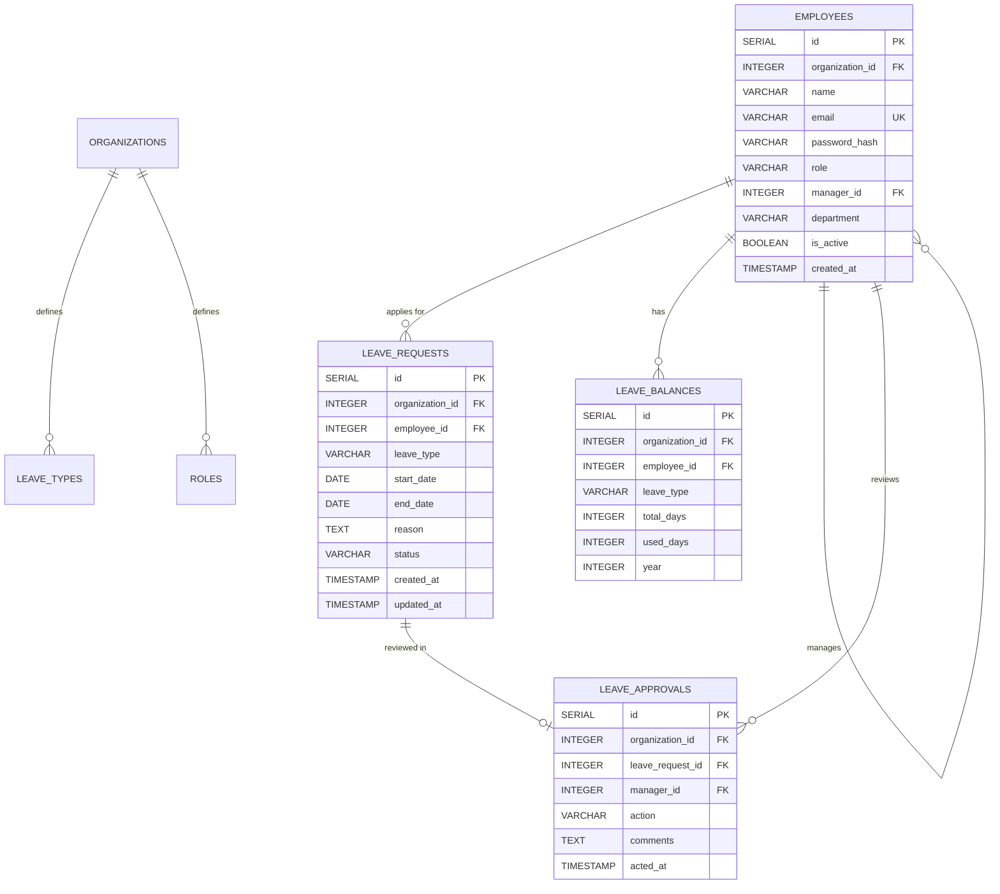

# Database Design
## Leave Management System

**Version:** 1.0  
**Date:** June 2026  

---

## 1. Entity Relationship Diagram



---

## 2. Database Schema (PostgreSQL)

### 2.1 Organizations (Tenants) Table
Stores the B2B clients who have been provisioned a workspace.

| Column Name | Data Type | Constraints | Description |
|-------------|-----------|-------------|-------------|
| `id` | UUID | Primary Key | Unique tenant identifier |
| `name` | VARCHAR(100) | Not Null | Company Name |
| `industry` | VARCHAR(50) | | Industry type |
| `size` | VARCHAR(20) | | Company size bracket |
| `created_at` | TIMESTAMP | Default NOW() | Provisioning date |

---

### 2.2 Employees Table
Stores user credentials, profile information, and role assignments.

| Column Name | Data Type | Constraints | Description |
|-------------|-----------|-------------|-------------|
| `id` | UUID | Primary Key | Unique employee identifier |
| `organization_id` | UUID | FK -> organizations(id) | The tenant this user belongs to |
| `first_name` | VARCHAR(50) | Not Null | User's first name |
| `last_name` | VARCHAR(50) | Not Null | User's last name |
| `email` | VARCHAR(100) | Unique, Not Null | Used for login |
| `password_hash` | VARCHAR(255) | | Nullable for OAuth-only users |
| `oauth_provider` | VARCHAR(20) | | 'google', 'facebook', null |
| `oauth_id` | VARCHAR(100) | | Unique ID from OAuth provider |
| `role` | VARCHAR(20) | Not Null | super_admin, admin, manager, employee |
| `department` | VARCHAR(50) | | Department name |
| `manager_id` | UUID | FK -> employees(id) | Self-referencing FK to direct manager |
| `is_active` | BOOLEAN | Default TRUE | Soft delete / Account status |
| `created_at` | TIMESTAMP | Default NOW() | Account creation time |

---

### 2.3 Leave Requests Table
Stores every leave application submitted by employees.

| Column | Type | Constraints | Description |
|--------|------|------------|-------------|
| `id` | UUID | Primary Key | Unique request identifier |
| `employee_id` | UUID | FK -> employees(id) | The applicant |
| `organization_id` | UUID | FK -> organizations(id) | The tenant |
| `leave_type` | VARCHAR(20) | Not Null | casual, sick, earned |
| `start_date` | DATE | Not Null | First day of leave |
| `end_date` | DATE | Not Null | Last day of leave |
| `duration_days` | NUMERIC(5,1)| Not Null | Calculated business days (excluding holidays) |
| `reason` | TEXT | Not Null | Reason provided by employee |
| `status` | VARCHAR(20) | Default 'pending'| pending, approved, rejected, cancelled |
| `applied_at` | TIMESTAMP | Default NOW() | Submission time |

---

### 2.4 Leave Balances Table
Tracks leave quotas per employee per leave type per year.

| Column | Type | Constraints | Description |
|--------|------|------------|-------------|
| `id` | UUID | Primary Key | Unique balance identifier |
| `employee_id` | UUID | FK -> employees(id) | The employee |
| `organization_id` | UUID | FK -> organizations(id) | The tenant |
| `leave_type` | VARCHAR(20) | Not Null | casual, sick, earned |
| `total_allowance` | NUMERIC(5,1)| Not Null | Total days given for the year |
| `used_days` | NUMERIC(5,1)| Default 0.0 | Days already consumed |
| `year` | INTEGER | Not Null | The applicable calendar year |

---

### 2.5 Approvals Table
Records manager actions on leave requests (audit trail).

| Column | Type | Constraints | Description |
|--------|------|------------|-------------|
| `id` | SERIAL | PRIMARY KEY | Unique approval action ID |
| `leave_request_id` | INTEGER | NOT NULL, REFERENCES leave_requests(id) ON DELETE CASCADE | Target leave request |
| `approver_id` | UUID | FK -> employees(id) | The manager/admin making the decision |
| `action` | VARCHAR(20) | Not Null | approved, rejected |
| `comments` | TEXT | | Optional explanation |
| `acted_at` | TIMESTAMP | Default NOW() | Action time |

---

### 2.6 System Settings Table
Global configuration rules per tenant.

| Column Name | Data Type | Constraints | Description |
|-------------|-----------|-------------|-------------|
| `id` | UUID | Primary Key | ID |
| `organization_id` | UUID | FK -> organizations(id) | Tenant |
| `setting_key` | VARCHAR(50) | Not Null | e.g. 'carry_forward_limit' |
| `setting_value` | VARCHAR(255)| Not Null | String value of the setting |

---

### 2.7 Holidays Table
Fixed days off defined by the organization.

| Column Name | Data Type | Constraints | Description |
|-------------|-----------|-------------|-------------|
| `id` | UUID | Primary Key | ID |
| `organization_id` | UUID | FK -> organizations(id) | Tenant |
| `name` | VARCHAR(100)| Not Null | e.g. 'New Year', 'Christmas' |
| `date` | DATE | Not Null | The specific holiday date |

---

### 2.8 Onboarding Applications Table
Stores prospective client leads before they are manually provisioned.

| Column Name | Data Type | Constraints | Description |
|-------------|-----------|-------------|-------------|
| `id` | UUID | Primary Key | Lead identifier |
| `contact_email` | VARCHAR(100)| Not Null | Applicant email |
| `company_name` | VARCHAR(100)| Not Null | Requested company name |
| `status` | VARCHAR(20) | Default 'pending' | pending, provisioned, rejected |
| `created_at` | TIMESTAMP | Default NOW() | Submission time |

---

### 2.9 Leave Types Table
Stores custom leave types configured by the Super Admin per tenant.

| Column Name | Data Type | Constraints | Description |
|-------------|-----------|-------------|-------------|
| `id` | UUID | Primary Key | Unique leave type identifier |
| `organization_id` | UUID | FK -> organizations(id) | Tenant |
| `name` | VARCHAR(100) | Not Null | E.g., 'Maternity', 'Sabbatical' |
| `description` | VARCHAR(255)| | Brief explanation |
| `default_days` | INTEGER | Default 0 | Annual default allowance |
| `is_paid` | BOOLEAN | Default TRUE| Paid vs unpaid leave |

---

### 2.10 Custom Roles Table
Allows dynamic generation of permission profiles.

| Column Name | Data Type | Constraints | Description |
|-------------|-----------|-------------|-------------|
| `id` | UUID | Primary Key | Unique role identifier |
| `organization_id` | UUID | FK -> organizations(id) | Tenant |
| `name` | VARCHAR(100) | Not Null | E.g., 'HR Manager', 'Intern' |
| `permissions` | JSONB | Not Null | JSON object of toggled permissions |

---

## 3. SQL Schema Definition (PostgreSQL)

```sql
-- =======================================================
-- LEAVE MANAGEMENT SYSTEM — POSTGRESQL DDL DEFINITIONS
-- =======================================================

-- Employees table
CREATE TABLE IF NOT EXISTS employees (
    id SERIAL PRIMARY KEY,
    organization_id INTEGER NOT NULL REFERENCES organizations(id) ON DELETE CASCADE,
    name VARCHAR(100) NOT NULL,
    email VARCHAR(255) NOT NULL UNIQUE,
    password_hash VARCHAR(255) NOT NULL,
    role VARCHAR(20) NOT NULL,
    manager_id INTEGER REFERENCES employees(id) ON DELETE SET NULL,
    department VARCHAR(100) NOT NULL DEFAULT 'General',
    is_active BOOLEAN NOT NULL DEFAULT TRUE,
    created_at TIMESTAMP NOT NULL DEFAULT NOW()
);

-- Leave requests table
CREATE TABLE IF NOT EXISTS leave_requests (
    id SERIAL PRIMARY KEY,
    organization_id INTEGER NOT NULL REFERENCES organizations(id) ON DELETE CASCADE,
    employee_id INTEGER NOT NULL REFERENCES employees(id) ON DELETE CASCADE,
    leave_type VARCHAR(20) NOT NULL CHECK (leave_type IN ('casual', 'sick', 'earned', 'unpaid')),
    start_date DATE NOT NULL,
    end_date DATE NOT NULL,
    reason TEXT NOT NULL,
    status VARCHAR(20) NOT NULL DEFAULT 'pending' CHECK (status IN ('pending', 'approved', 'rejected', 'cancelled')),
    created_at TIMESTAMP NOT NULL DEFAULT NOW(),
    updated_at TIMESTAMP NOT NULL DEFAULT NOW()
);

-- Leave approvals table (audit trail)
CREATE TABLE IF NOT EXISTS leave_approvals (
    id SERIAL PRIMARY KEY,
    organization_id INTEGER NOT NULL REFERENCES organizations(id) ON DELETE CASCADE,
    leave_request_id INTEGER NOT NULL REFERENCES leave_requests(id) ON DELETE CASCADE,
    manager_id INTEGER NOT NULL REFERENCES employees(id),
    action VARCHAR(20) NOT NULL CHECK (action IN ('approved', 'rejected')),
    comments TEXT,
    acted_at TIMESTAMP NOT NULL DEFAULT NOW()
);

-- Leave balances table
CREATE TABLE IF NOT EXISTS leave_balances (
    id SERIAL PRIMARY KEY,
    organization_id INTEGER NOT NULL REFERENCES organizations(id) ON DELETE CASCADE,
    employee_id INTEGER NOT NULL REFERENCES employees(id) ON DELETE CASCADE,
    leave_type VARCHAR(20) NOT NULL CHECK (leave_type IN ('casual', 'sick', 'earned')),
    total_days INTEGER NOT NULL,
    used_days INTEGER NOT NULL DEFAULT 0,
    year INTEGER NOT NULL,
    UNIQUE(employee_id, leave_type, year)
);

-- Indexes for optimized query execution
CREATE INDEX IF NOT EXISTS idx_employees_email ON employees(email);
CREATE INDEX IF NOT EXISTS idx_employees_manager_id ON employees(manager_id);
CREATE INDEX IF NOT EXISTS idx_employees_role ON employees(role);
CREATE INDEX IF NOT EXISTS idx_leaves_employee_id ON leave_requests(employee_id);
CREATE INDEX IF NOT EXISTS idx_leaves_status ON leave_requests(status);
CREATE INDEX IF NOT EXISTS idx_leaves_dates ON leave_requests(start_date, end_date);
CREATE INDEX IF NOT EXISTS idx_approvals_leave_id ON leave_approvals(leave_request_id);
CREATE INDEX IF NOT EXISTS idx_approvals_manager_id ON leave_approvals(manager_id);
CREATE INDEX IF NOT EXISTS idx_balances_employee_year ON leave_balances(employee_id, year);

-- Auto-update updated_at modifier function
CREATE OR REPLACE FUNCTION update_updated_at()
RETURNS TRIGGER AS $$
BEGIN
    NEW.updated_at = NOW();
    RETURN NEW;
END;
$$ LANGUAGE plpgsql;

CREATE TRIGGER trg_leave_requests_updated_at
    BEFORE UPDATE ON leave_requests
    FOR EACH ROW
    EXECUTE FUNCTION update_updated_at();
```

---

> 📄 For module-level implementation details, see: [Low Level Design (LLD)](06-LLD.md)  
> 📄 For API endpoint specifications, see: [API Documentation](07-API-Documentation.md)
