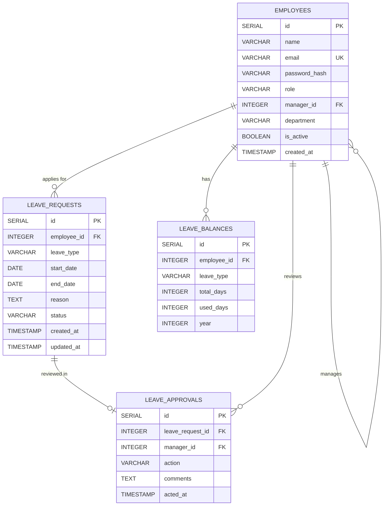

# Database Design
## Leave Management System

**Version:** 1.0  
**Date:** June 2026  

---

## 1. Entity Relationship Diagram



---

## 2. Database Schema (PostgreSQL)

### 2.1 `employees` Table
Stores user accounts for employees, managers, and admins.

| Column | Type | Constraints | Description |
|--------|------|------------|-------------|
| `id` | SERIAL | PRIMARY KEY | Unique employee ID |
| `name` | VARCHAR(100) | NOT NULL | Full name |
| `email` | VARCHAR(255) | NOT NULL, UNIQUE | Login email address |
| `password_hash` | VARCHAR(255) | NOT NULL | bcrypt hashed password |
| `role` | VARCHAR(20) | NOT NULL, CHECK(role IN ('super_admin','admin','hr','finance','manager','employee')) | System authorization role |
| `manager_id` | INTEGER | REFERENCES employees(id), NULLABLE | Reporting manager ID |
| `department` | VARCHAR(100) | NOT NULL, DEFAULT 'General' | Department group |
| `is_active` | BOOLEAN | NOT NULL, DEFAULT TRUE | Status toggle |
| `created_at` | TIMESTAMP | NOT NULL, DEFAULT NOW() | Record creation date |

**Indexes:**
- `idx_employees_email` on `email`
- `idx_employees_manager_id` on `manager_id`
- `idx_employees_role` on `role`

---

### 2.2 `leave_requests` Table
Stores every leave application submitted by employees.

| Column | Type | Constraints | Description |
|--------|------|------------|-------------|
| `id` | SERIAL | PRIMARY KEY | Unique leave request ID |
| `employee_id` | INTEGER | NOT NULL, REFERENCES employees(id) ON DELETE CASCADE | Associated employee |
| `leave_type` | VARCHAR(20) | NOT NULL, CHECK(leave_type IN ('casual','sick','earned','unpaid')) | Category of leave |
| `start_date` | DATE | NOT NULL | Target starting date |
| `end_date` | DATE | NOT NULL | Target end date |
| `reason` | TEXT | NOT NULL | Employee explanation |
| `status` | VARCHAR(20) | NOT NULL, DEFAULT 'pending', CHECK(status IN ('pending','approved','rejected','cancelled')) | Current workflow status |
| `created_at` | TIMESTAMP | NOT NULL, DEFAULT NOW() | Submission timestamp |
| `updated_at` | TIMESTAMP | NOT NULL, DEFAULT NOW() | Status alteration timestamp |

**Indexes:**
- `idx_leaves_employee_id` on `employee_id`
- `idx_leaves_status` on `status`
- `idx_leaves_dates` on `start_date, end_date`

---

### 2.3 `leave_approvals` Table
Records manager actions on leave requests (audit trail).

| Column | Type | Constraints | Description |
|--------|------|------------|-------------|
| `id` | SERIAL | PRIMARY KEY | Unique approval action ID |
| `leave_request_id` | INTEGER | NOT NULL, REFERENCES leave_requests(id) ON DELETE CASCADE | Target leave request |
| `manager_id` | INTEGER | NOT NULL, REFERENCES employees(id) | Acting manager reviewer |
| `action` | VARCHAR(20) | NOT NULL, CHECK(action IN ('approved','rejected')) | Decision taken |
| `comments` | TEXT | NULLABLE | Decision comments |
| `acted_at` | TIMESTAMP | NOT NULL, DEFAULT NOW() | Evaluation timestamp |

**Indexes:**
- `idx_approvals_leave_id` on `leave_request_id`
- `idx_approvals_manager_id` on `manager_id`

---

### 2.4 `leave_balances` Table
Tracks leave quotas per employee per leave type per year.

| Column | Type | Constraints | Description |
|--------|------|------------|-------------|
| `id` | SERIAL | PRIMARY KEY | Unique balance row ID |
| `employee_id` | INTEGER | NOT NULL, REFERENCES employees(id) ON DELETE CASCADE | Target employee |
| `leave_type` | VARCHAR(20) | NOT NULL, CHECK(leave_type IN ('casual','sick','earned')) | Balance category type |
| `total_days` | INTEGER | NOT NULL | Allocated credit for the calendar year |
| `used_days` | INTEGER | NOT NULL, DEFAULT 0 | Consumed balance |
| `year` | INTEGER | NOT NULL | Calendar year target |

**Constraints:**
- UNIQUE(`employee_id`, `leave_type`, `year`)

**Indexes:**
- `idx_balances_employee_year` on `employee_id, year`

---

## 3. SQL Schema Definition (PostgreSQL)

```sql
-- =======================================================
-- LEAVE MANAGEMENT SYSTEM — POSTGRESQL DDL DEFINITIONS
-- =======================================================

-- Employees table
CREATE TABLE IF NOT EXISTS employees (
    id SERIAL PRIMARY KEY,
    name VARCHAR(100) NOT NULL,
    email VARCHAR(255) NOT NULL UNIQUE,
    password_hash VARCHAR(255) NOT NULL,
    role VARCHAR(20) NOT NULL CHECK (role IN ('super_admin', 'admin', 'hr', 'finance', 'manager', 'employee')),
    manager_id INTEGER REFERENCES employees(id) ON DELETE SET NULL,
    department VARCHAR(100) NOT NULL DEFAULT 'General',
    is_active BOOLEAN NOT NULL DEFAULT TRUE,
    created_at TIMESTAMP NOT NULL DEFAULT NOW()
);

-- Leave requests table
CREATE TABLE IF NOT EXISTS leave_requests (
    id SERIAL PRIMARY KEY,
    employee_id INTEGER NOT NULL REFERENCES employees(id) ON DELETE CASCADE,
    leave_type VARCHAR(20) NOT NULL CHECK (leave_type IN ('casual', 'sick', 'earned', 'unpaid')),
    start_date DATE NOT NULL,
    end_date DATE NOT NULL,
    reason TEXT NOT NULL,
    status VARCHAR(20) NOT NULL DEFAULT 'pending' CHECK (status IN ('pending', 'approved', 'rejected', 'cancelled')),
    created_at TIMESTAMP NOT NULL DEFAULT NOW(),
    updated_at TIMESTAMP NOT NULL DEFAULT NOW()
);

-- Leave approvals table (audit trail)
CREATE TABLE IF NOT EXISTS leave_approvals (
    id SERIAL PRIMARY KEY,
    leave_request_id INTEGER NOT NULL REFERENCES leave_requests(id) ON DELETE CASCADE,
    manager_id INTEGER NOT NULL REFERENCES employees(id),
    action VARCHAR(20) NOT NULL CHECK (action IN ('approved', 'rejected')),
    comments TEXT,
    acted_at TIMESTAMP NOT NULL DEFAULT NOW()
);

-- Leave balances table
CREATE TABLE IF NOT EXISTS leave_balances (
    id SERIAL PRIMARY KEY,
    employee_id INTEGER NOT NULL REFERENCES employees(id) ON DELETE CASCADE,
    leave_type VARCHAR(20) NOT NULL CHECK (leave_type IN ('casual', 'sick', 'earned')),
    total_days INTEGER NOT NULL,
    used_days INTEGER NOT NULL DEFAULT 0,
    year INTEGER NOT NULL,
    UNIQUE(employee_id, leave_type, year)
);

-- Indexes for optimized query execution
CREATE INDEX IF NOT EXISTS idx_employees_email ON employees(email);
CREATE INDEX IF NOT EXISTS idx_employees_manager_id ON employees(manager_id);
CREATE INDEX IF NOT EXISTS idx_employees_role ON employees(role);
CREATE INDEX IF NOT EXISTS idx_leaves_employee_id ON leave_requests(employee_id);
CREATE INDEX IF NOT EXISTS idx_leaves_status ON leave_requests(status);
CREATE INDEX IF NOT EXISTS idx_leaves_dates ON leave_requests(start_date, end_date);
CREATE INDEX IF NOT EXISTS idx_approvals_leave_id ON leave_approvals(leave_request_id);
CREATE INDEX IF NOT EXISTS idx_approvals_manager_id ON leave_approvals(manager_id);
CREATE INDEX IF NOT EXISTS idx_balances_employee_year ON leave_balances(employee_id, year);

-- Auto-update updated_at modifier function
CREATE OR REPLACE FUNCTION update_updated_at()
RETURNS TRIGGER AS $$
BEGIN
    NEW.updated_at = NOW();
    RETURN NEW;
END;
$$ LANGUAGE plpgsql;

CREATE TRIGGER trg_leave_requests_updated_at
    BEFORE UPDATE ON leave_requests
    FOR EACH ROW
    EXECUTE FUNCTION update_updated_at();
```

---

> 📄 For module-level implementation details, see: [Low Level Design (LLD)](06-LLD.md)  
> 📄 For API endpoint specifications, see: [API Documentation](07-API-Documentation.md)
