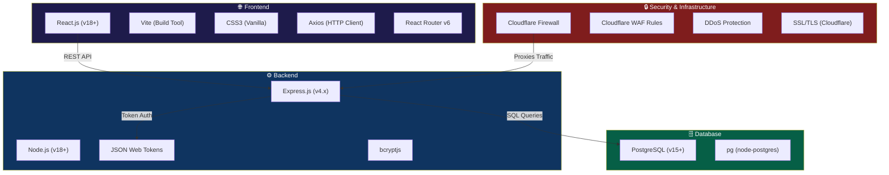
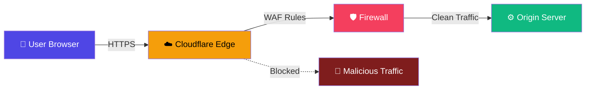
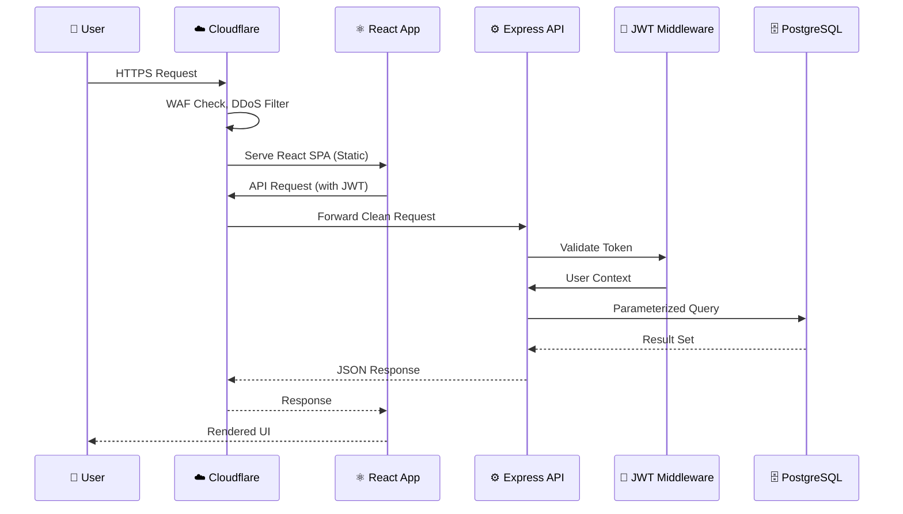
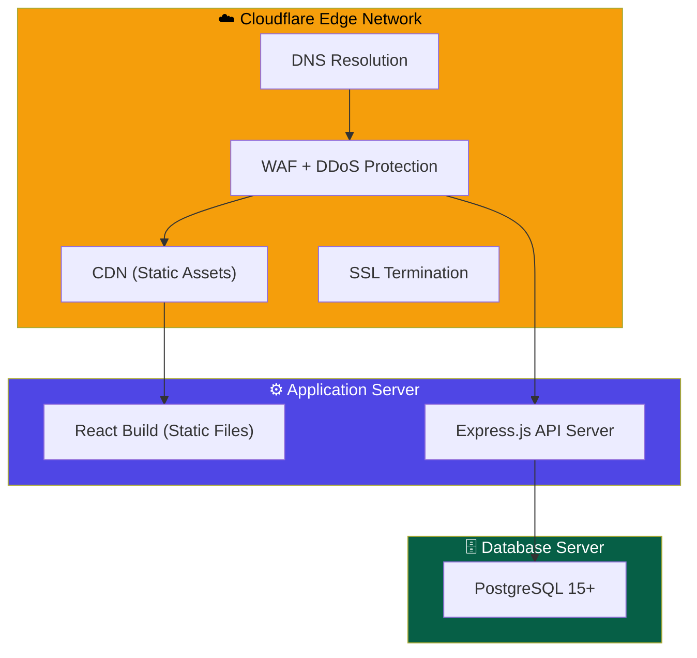

# Technology Requirements Document (TRD)
## Leave Management System

**Version:** 1.0  
**Date:** June 2026  

---

## 1. Technology Stack Overview



---

## 2. Detailed Technology Breakdown

### 2.1 Frontend Technologies

| Technology | Version | Purpose | Why Chosen |
|-----------|:-------:|---------|------------|
| **React.js** | 18+ | UI Library | Component-based architecture, virtual DOM for performance, vast ecosystem, industry standard |
| **Vite** | 5+ | Build Tool | Lightning-fast HMR, optimized production builds, native ES modules |
| **React Router** | v6 | Client-Side Routing | Declarative routing, nested routes, URL-based navigation |
| **Axios** | 1.x | HTTP Client | Promise-based, interceptors for JWT, automatic JSON parsing |
| **CSS3 (Vanilla)** | — | Styling | Full control, no utility-class bloat, custom design system |
| **React Context API** | — | State Management | Built-in, lightweight, sufficient for auth & app state |

### 2.2 Backend Technologies

| Technology | Version | Purpose | Why Chosen |
|-----------|:-------:|---------|------------|
| **Node.js** | 18+ | Runtime Environment | Non-blocking I/O, JavaScript ecosystem, excellent for REST APIs |
| **Express.js** | 4.x | Web Framework | Minimal, flexible, middleware architecture, huge community |
| **pg (node-postgres)** | 8.x | PostgreSQL Client | Native PostgreSQL driver, connection pooling, parameterized queries |
| **jsonwebtoken** | 9.x | Authentication | Stateless auth, industry standard, easy to implement |
| **bcryptjs** | 2.x | Password Hashing | Secure password storage, configurable salt rounds |
| **cors** | 2.x | Cross-Origin Requests | Required for React (separate dev server) to talk to Express |
| **dotenv** | 16.x | Environment Config | Secure configuration management |

### 2.3 Database

| Technology | Version | Purpose | Why Chosen |
|-----------|:-------:|---------|------------|
| **PostgreSQL** | 15+ | Relational Database | ACID compliance, robust query optimizer, production-grade reliability, advanced data types, excellent JSON support |

**PostgreSQL Advantages for this project:**
- ✅ **ACID transactions** — ensures data integrity for leave balance updates
- ✅ **Foreign key constraints** — enforces referential integrity between employees, leaves, approvals
- ✅ **CHECK constraints** — validates status enums, role values at the database level
- ✅ **Connection pooling** — handles concurrent requests efficiently
- ✅ **Index support** — B-tree, partial indexes for optimized queries
- ✅ **Production-ready** — scales from development to enterprise deployment

### 2.4 Authentication & Security

| Technology | Version | Purpose | Why Chosen |
|-----------|:-------:|---------|------------|
| **JWT (JSON Web Tokens)** | — | Authentication | Stateless, scalable, no server-side session store needed |
| **bcryptjs** | 2.x | Password Hashing | Industry-standard, resistant to brute-force & rainbow table attacks |
| **Cloudflare Firewall** | — | Web Application Firewall | DDoS protection, WAF rules, bot mitigation, SSL/TLS termination |

---

## 3. Cloudflare Firewall Configuration

### 3.1 Why Cloudflare?

Cloudflare acts as a **reverse proxy** between the internet and our application server, providing multiple security layers:



### 3.2 Firewall Features Used

| Feature | Configuration | Purpose |
|---------|:------------:|---------|
| **DDoS Protection** | Auto (Free Tier) | Mitigates volumetric & application-layer attacks |
| **WAF (Web Application Firewall)** | Managed Rulesets | Blocks SQLi, XSS, RCE, and common OWASP threats |
| **Rate Limiting** | 100 req/min per IP on `/api/auth/login` | Prevents brute-force login attempts |
| **Bot Management** | Challenge suspicious bots | Filters automated attacks |
| **SSL/TLS** | Full (Strict) mode | End-to-end encryption between user → Cloudflare → server |
| **IP Access Rules** | Allow/Block specific IPs | Geo-blocking, admin IP whitelisting |
| **Security Headers** | HSTS, X-Frame-Options, CSP | Hardens HTTP response headers |

### 3.3 Firewall Rules

| Rule Name | Expression | Action |
|-----------|-----------|--------|
| Block SQL Injection | `http.request.uri.query contains "UNION" or "SELECT"` | Block |
| Rate Limit Login | `http.request.uri.path eq "/api/auth/login"` | Rate Limit (100/min) |
| Block Known Bad Bots | `cf.client.bot` | Challenge |
| Geo-Block (Optional) | `ip.geoip.country ne "IN"` | Challenge |
| Protect Admin APIs | `http.request.uri.path contains "/api/employees"` | Managed Challenge |

---

## 4. Architecture Layers

### 4.1 Request Lifecycle



### 4.2 Deployment Architecture



---

## 5. Development Tools & Environment

| Tool | Purpose |
|------|---------|
| **VS Code** | Code editor |
| **pgAdmin / DBeaver** | PostgreSQL GUI management |
| **Postman** | API testing |
| **Git + GitHub** | Version control & repository hosting |
| **npm** | Package management |
| **ESLint** | Code quality & linting |
| **Cloudflare Dashboard** | Firewall management & analytics |

---

## 6. Environment Variables

```env
# Server
PORT=3000
NODE_ENV=development

# Database (PostgreSQL)
DB_HOST=localhost
DB_PORT=5432
DB_NAME=leave_management
DB_USER=postgres
DB_PASSWORD=your_password

# Authentication
JWT_SECRET=your-super-secret-jwt-key
JWT_EXPIRES_IN=24h

# Cloudflare (for API if needed)
CF_ZONE_ID=your_zone_id
CF_API_TOKEN=your_api_token
```

---

## 7. System Requirements

### Development Environment
| Requirement | Minimum |
|-------------|---------|
| **Node.js** | v18.0 or higher |
| **npm** | v9.0 or higher |
| **PostgreSQL** | v15.0 or higher |
| **RAM** | 4 GB |
| **Disk Space** | 500 MB |

### Production Environment
| Requirement | Recommended |
|-------------|------------|
| **Server** | 2 vCPU, 4GB RAM |
| **PostgreSQL** | Dedicated instance or managed service (e.g., Supabase, Railway, RDS) |
| **Cloudflare** | Free or Pro plan |
| **Domain** | Custom domain pointed to Cloudflare |
